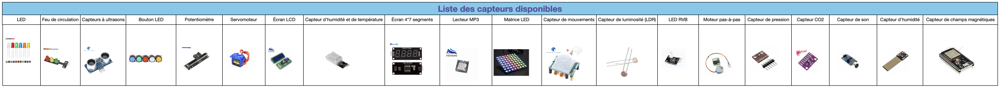
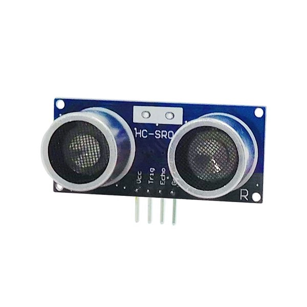
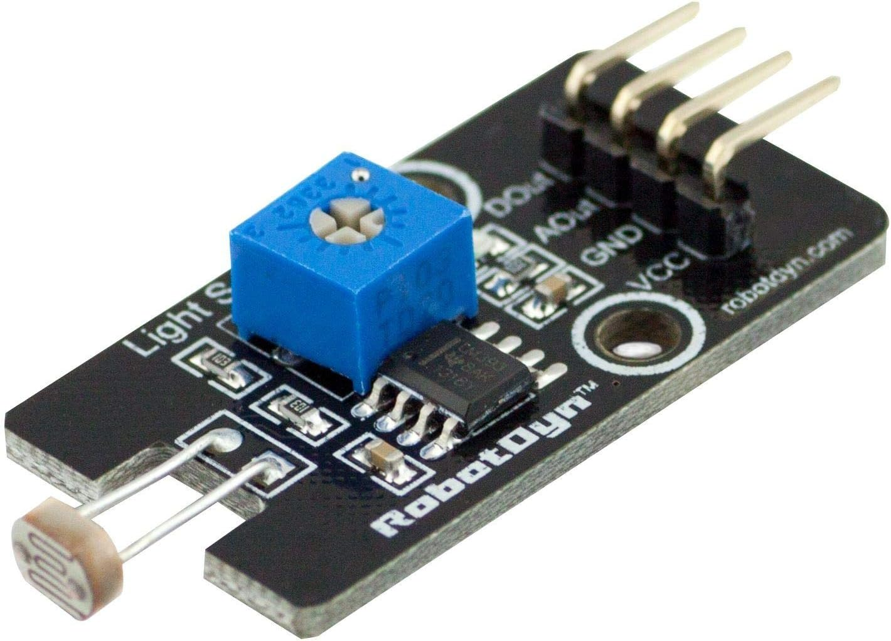
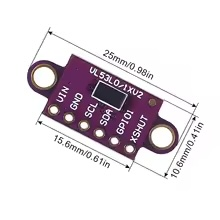

# Initiation à la programmation Arduino et ESP32

---

## Avant de commencer

Nous avons déjà téléchargé l'environnement de développement (IDE) Platform.IO sur Visual Studio Code. Pour votre culture personnelle, les outils sont téléchargeables ici :
- https://code.visualstudio.com/
- https://marketplace.visualstudio.com/items?itemName=platformio.platformio-ide

Ce n'est pas un cours d'électronique : nous passons donc sous silence un grand nombre de termes afin de pouvoir programmer rapidement un objet fonctionnel.

---

## Présentation de l'ESP32

L'ESP32 est une carte construite autour d'un microcontrôleur qui peut être programmé pour analyser et produire des signaux électriques de manière à effectuer des tâches très diverses comme la domotique (le contrôle des appareils domestiques - éclairage, chauffage…), le pilotage d'un robot, de l'informatique embarquée, etc.

On peut étendre les capacités de l'ESP32 en y branchant des composants, par exemple : des capteurs (de température, de son, de distance, etc.) ou encore des leds, des moteurs, etc. 

Chaque composant a besoin d'être alimenté : branché sur une source de tension (5V ou 3.3V) et une masse (GND) pour fonctionner. Pour renvoyer des informations (si c'est un capteur) ou en recevoir (par ex un servo-moteur), il faut aussi le brancher sur une (ou plusieurs) broche(s) de l'Arduino. Cela lui permet de communiquer avec ce dernier.

Pour cet atelier, nous allons utiliser une carte ESP32 qui peut se connecter à un réseau wifi, et qui peut aussi communiquer via Bluetooth.

Pour brancher beaucoup de composants à la fois, le plus simple est d'utiliser un support, permettant d'avoir une alimentation (+5V, Ground) pour chaque broche afin de faciliter le câblage des composants. L'ESP32 est déjà mis sur ce support et branché sur votre ordinateur.

Ci-dessous une photo d'un ESP32 et de son support :


---
### Comment brancher l'esp32 à votre ordinateur

Prenez le cable USB fourni et branchez le sur `le port usb de l'esp32 et non pas celui du support`, puis branchez le sur l'ordinateur.

Lorsque vous ajouterez des capteurs, il faudra débrancher l'esp32 (pour l'éteindre), faire les branchements, puis rebrancher l'esp32.

---

## Maintenant, un peu de programmation !

Ouvrez le dossier `stage_ada` en haut à gauche sur le bureau de l'ordinateur, puis double-cliquez sur le fichier `.workspace` pour ouvrir votre éditeur Visual Studio Code préconfiguré.

Visual Studio s'ouvre sur le projet `MonSuperProjet` que vous allez modifier pour utiliser les capteurs.

Vous pouvez commencer à programmer dans le fichier `main.cpp` dans le dossier `src`. Vous trouverez ci-après des exemples de programmes pour chaque capteur présent dans votre bac, 
et vous aurez juste à les copier puis les coller à la place du contenu du `main.cpp`.

 


## Jouons avec un feu tricolore !

Pour commencer à s'amuser avec l'ESP32, prenons une DEL (par la suite nous utiliserons le feu tricolore).

### On commence par apprendre à allumer la lumière...

La DEL (ou LED en anglais) est un composant simple s'allumant quand elle reçoit du courant. Nous allons commencer par brancher une DEL sur notre Arduino. 

Les DEL ont des tensions précises de fonctionnement mais les broches de l'ESP32 fournissent du +5V, il faut donc réduire l'alimentation des DEL en utilisant une résistance. Les fils sont normalement déjà branchés sur la LED, voici comment les brancher sur la carte maintenant :

* Branchez un fil entre la patte sans résistance de la DEL et la broche **G** du port **D5** de l'ESP32
* Branchez un fil entre la patte avec résistance de la DEL et la broche **S** du port **D5** de l'ESP32

Pour téléverser le programme suivant, il y a tout en bas de votre fenêtre une flèche vers la droite, cliquez dessus :


Après quelques secondes, la DEL devrait clignoter !

Jouez avec la valeur inscrite dans les fonctions `delay` pour la faire clignoter plus ou moins vite.

```C
#include <Arduino.h>
#include <Wire.h>
#include <SPI.h>
#include <Adafruit_I2CDevice.h>

#define LED1 5

void setup() {
  pinMode(LED1, OUTPUT);
}
void loop() {
  digitalWrite(LED1, HIGH);
  delay(500);
  digitalWrite(LED1, LOW);
  delay(500);
}
```

### Et maintenant le feu de circulation !

Prenez le feu tricolore présent dans votre kit. Détachez un groupe de 4 fils :

* Branchez un fil entre la broche **G** du feu et la broche **S** du port D5
* Branchez un fil entre la broche **Y** du feu et la broche **S** du port D4
* Branchez un fil entre la broche **R** du feu et la broche **S** du port D2
* Branchez un fil entre la broche **GND** du feu et la broche **G** du port D2, D4 ou D5


```C
#include <Arduino.h>
#include <Adafruit_I2CDevice.h>

#define GREEN_PIN 5
#define YELLOW_PIN 4
#define RED_PIN 2

void setup() {
  pinMode(GREEN_PIN, OUTPUT);
  pinMode(YELLOW_PIN, OUTPUT);
  pinMode(RED_PIN, OUTPUT);
}

void loop() {
  digitalWrite(GREEN_PIN, HIGH);
  digitalWrite(YELLOW_PIN, LOW);
  digitalWrite(RED_PIN, LOW);
  delay(500); 
  digitalWrite(GREEN_PIN, LOW);
  digitalWrite(YELLOW_PIN, HIGH);
  digitalWrite(RED_PIN, LOW);
  delay(500);
  digitalWrite(GREEN_PIN, LOW);
  digitalWrite(YELLOW_PIN, LOW);
  digitalWrite(RED_PIN, HIGH);
  delay(500); 
}
```

---

## Un peu de théorie : Analyse d'un  programme Arduino

Tous les programmes Arduino doivent respecter cette structure :

```C
#include <Arduino.h> // ici, on déclare l'utilisation de la librairie Arduino
#include <Adafruit_I2CDevice.h>
// Vous pouvez déclarer les variables globales de votre script ici
int entier = 0;
void setup() {
  // Cette fonction sera lancée une seule fois au démarrage de l'ESP32
  // C'est ici que vous initialiserez les entrées et sorties de l'ESP32
  // Typiquement vous pouvez initialiser la liaison série
  // entre l'ESP32 et votre ordinateur :
  Serial.begin(115200);
}


void loop() {
    // Cette fonction sera appelée continuellement après le setup
    // Pour déboguer, la liaison série est pratique :

    Serial.println("Test");

    // La fonction "delay(X)" permet de mettre en pause le programme pendant X ms

    delay(200);
}
```
---

## Ouvrons la caverne d'AliBaba ...

Voici la liste des composants Arduino avec lesquels vous pourrez construire votre projet, avec le code exemple à utiliser pour les faire fonctionner :



---
### Mesurer une distance avec des ultrasons

On peut utiliser un capteur ultrason (HR-SR04) pour mesurer une distance. On envoie des ondes sonores (inaudibles) vers un obstacle et on mesure le temps qui s'écoule avant de les recapter. À partir de la mesure de ce temps écoulé on peut, grâce à la connaissance de la vitesse du son dans l'air, estimer la distance entre le capteur et l'objet devant lui.

En théorie, le capteur peut capter les obstacles sur un angle de 15° environ et permet de faire des mesures de distance entre 2 centimètres et 4 mètres avec une précision de 3 millimètres.



Détachez un groupe de 4 fils :
* Branchez un fil entre la broche **Trig** du capteur et la broche **S** du port D32
* Branchez un fil entre la broche **Echo** du capteur et la broche **S** du port D33
* Branchez un fil entre la broche **GND** du capteur et la broche **G** du port D32
* Branchez un fil entre la broche **VCC** du capteur et la broche **V** du port D32

Téléversez le code suivant :

```C
#include <Arduino.h>
#include <Wire.h>
#include <SPI.h>
#include <Adafruit_I2CDevice.h>

#define trigPin 32
#define echoPin 33

void setup() {
  Serial.begin (115200);
  pinMode(trigPin, OUTPUT);
  pinMode(echoPin, INPUT);
}

void loop() {
  // Envoi une impulsion de 10 micro seconde sur la broche "trigger"
  digitalWrite(trigPin, LOW);
  delayMicroseconds(2);

  digitalWrite(trigPin, HIGH);
  delayMicroseconds(10);

  digitalWrite(trigPin, LOW);
  // Attend que la broche Echo passe au niveau HAUT
  // retourne la durée
  int duration = pulseIn(echoPin, HIGH);

  //Calculer la distance (en cm, basée sur la vitesse du son).
  int distance = duration / 58.2;
  Serial.print("distance=");
  Serial.println(distance);
  delay(500);
}
```

Travail complémentaire : faire un radar de recul. Selon la distance de l'obstacle, vous allumerez les DEL verte, jaune et enfin rouge du feu tricolore.

---


### Utiliser un potentiomètre

Ce composant permet d'avoir une valeur comprise entre 0 et 4095 selon la position du curseur.


Détachez un groupe de 3 fils. On va brancher les fils du côté "A" :
* Branchez un fil entre la broche OTB (ou OUT) du potentiomètre et la broche **S** du port D34
* Branchez un fil entre la broche VCC du potentiomètre et la broche **G** du port D34
* Branchez un fil entre la broche GND du potentiomètre et la broche **V** du port D34

Téléversez le programme suivant et vérifiez que les valeurs s'affichent bien sur le terminal :

```C
#include <Arduino.h>
#include <Wire.h>
#include <SPI.h>
#include <Adafruit_I2CDevice.h>

#define POTAR 34

void setup() {
  pinMode(POTAR, INPUT);
  Serial.begin(115200);
}

void loop() {
  int val = analogRead(POTAR);
  Serial.print("val=");
  Serial.println(val);
  int percent = map(val, 0, 4095, 0, 100); // permet de convertir la valeur en pourcentage
  Serial.print("percent=");
  Serial.println(percent);
  delay(400);
}
```

Travail complémentaire : Faire varier le temps de clignotement d'une DEL avec le potentiomètre.

---

### Récupérer le niveau d'eau

Un capteur nous permet de récupérer le niveau de l'eau sur une échelle de 0 à 521 lorsque celui-ci est plongé dans un verre par exemple. Il peut aussi permettre de mesurer le niveau d'hydratation d'une plante !


Pour le connecter à l'ESP32, détachez un groupe de 3 fils : 
* Branchez un cable entre la broche **OUT** du capteur et le pin **S** de la broche **VP** de l'ESP
* Branchez un cable entre la broche **VCC** du capteur et le pin **VCC** de la broche **D17** de l'ESP
* Branchez un cable entre la broche **GND** du capteur et le pin **GND** de la broche **D17** de l'ESP

Téléversez le code suivant sur la carte, le niveau de l'eau devrait s'afficher dans le terminal.
```cpp
#include <Arduino.h>
#include <SPI.h>
#include <Adafruit_I2CDevice.h>
#include <Wire.h>

#define POWER_PIN  17 // ESP32 pin GIOP17 connected to sensor's VCC pin
#define SIGNAL_PIN 36 // ESP32 pin GIOP36 (ADC0) connected to sensor's signal pin

int value = 0; // variable to store the sensor value

void setup() {
  Serial.begin(115200);
  pinMode(POWER_PIN, OUTPUT);   // configure pin as an OUTPUT
  digitalWrite(POWER_PIN, LOW); // turn the sensor OFF
}

void loop() {
  digitalWrite(POWER_PIN, HIGH);  // turn the sensor ON
  delay(10);                      // wait 10 milliseconds
  value = analogRead(SIGNAL_PIN); // read the analog value from sensor
  digitalWrite(POWER_PIN, LOW);   // turn the sensor OFF

  Serial.print("The water sensor value: ");
  Serial.println(value);

  delay(1000);
}
```
### Faire tourner un servomoteur

Un servomoteur est un petit moteur pouvant tourner précisément sur 180°.


Branchez directement la prise du servomoteur sur le port D23 de l'ESP32 en faisant attention à ce que :
* le fil marron soit sur la broche **G** du port D23, 
* le fil rouge sur la broche **V** du port D23,
* le fil orange sur la broche **S** du port D23

Téléversez le programme suivant : 

```C
#include <Arduino.h>
#include <Wire.h>
#include <SPI.h>
#include <Adafruit_I2CDevice.h>
#include <pwmWrite.h>

#define SERVO 23
Pwm pwm = Pwm();

void setup() {
  Serial.begin(115200);
  pwm.writeServo(SERVO, 0);
}

int deg = 0;
int inc = 1;

void loop() {
  pwm.writeServo(SERVO, deg);
  deg = deg + inc;
  if (deg > 180) {
    inc = -1;
    deg = 180;
  }
  if (deg < 0) {
    inc = 1;
    deg = 0;
  }
  delay(20);
}
```

La ligne `#include <pwmWrite.h>` charge la bibliothèque permettant de piloter facilement un servomoteur. Cette bibliothèque est fournie dans votre fichier de configuration.

Ajoutez un des morceaux de plastique sur l'axe du servomoteur afin de bien visualiser les mouvements.

Travail complémentaire : Faire tourner le servomoteur à partir de la valeur d'un potentiomètre (utilisation de la fonction [map](https://www.arduino.cc/reference/en/language/functions/math/map/) pour convertir les valeurs d'entrées du potentiomètre - de 0 à 4095 - en une valeur en degrés - de 0 à 180) :

```C
#include <Arduino.h>
#include <Wire.h>
#include "pwmWrite.h"
#include <SPI.h>
#include <Adafruit_I2CDevice.h>

#define SERVO 23
#define POTAR 34

Pwm pwm = Pwm();

void setup() {
  Serial.begin(115200);
  pinMode(POTAR, INPUT);

  pwm.writeServo(SERVO, 0);
}

void loop() {
  int val = analogRead(POTAR);
  Serial.print("val=");
  Serial.println(val);
  int deg = map(val, 0, 4095, 0, 180);
  pwm.writeServo(SERVO, deg);
  delay(10);
}
```

---

### Le Bus I²C

Le bus I²C permet de brancher plusieurs composants (esclaves) sur l'ESP32 (maître). Vous trouverez plus d'informations sur  [la page Wikipédia sur le sujet](https://fr.wikipedia.org/wiki/I2C).

Il va nous permettre ici de brancher plusieurs composants supportant la norme I²C. Sur un ESP32 les ports I²C utilisent les ports D21 et D22, il ne faut donc pas brancher d'autres composants sur ces ports.

Pour brancher votre bus :
* le fil GND sur la broche GND à droite de la carte
* le fil VCC sur la broche VCC à droite de la carte
* le fil SDA sur la broche D21
* le fil SCL sur la broche D22


---

### Afficher des informations sur un écran LCD I²C

Les écrans LCD permettent d'afficher des informations facilement. La version présentée ici utilise une interface I²C.

Ces écrans nécessitent une bibliothèque particulière qui est déjà configurée dans votre projet.


Détachez un groupe de 4 fils :
* Branchez un fil entre la broche **SCL** de l'écran et la broche **SCL** (D22) de votre rampe I²C
* Branchez un fil entre la broche **SDA** de l'écran et la broche **SDA** (D21) de votre rampe I²C
* Branchez un fil entre la broche **GND** de l'écran et la broche **GND** de votre rampe I²C
* Branchez un fil entre la broche **VCC** de l'écran et une broche **5V** de l'ESP32.

Téléversez le programme suivant :

```C
#include <Arduino.h>
#include <Wire.h>
#include <SPI.h>
#include <Adafruit_I2CDevice.h>

#include <LiquidCrystal_I2C.h>
#define i2cDisplayPort 0x27 // ou 0x3F
LiquidCrystal_I2C lcd(i2cDisplayPort,16,2);
int increment = 0;

void setup() {
  lcd.init();
  lcd.setBacklight(HIGH); 
}
  
void loop() {

    lcd.clear();
    lcd.print("Ligne 1");
    lcd.setCursor(0, 1);
    lcd.print("Ligne 2 : ");
    lcd.print(increment);
    if (increment==10) {
      // On éteint le retroéclairage au bout de 10s
      lcd.setBacklight(LOW); 
    } else if (increment==12) {
      // On allume le retroéclairage au bout de 12s
      lcd.setBacklight(HIGH); 
    }
    increment++;
    delay(1000);
    
}
```

Vérifiez le contraste de l'écran : ce dernier doit s'allumer au démarrage. Si vous ne voyez rien, pas de panique c'est peut-être tout simplement parce que le contraste est mal réglé. Pour changer ce paramètre il suffit de tourner le petit potentiomètre derrière l'écran avec un tournevis cruciforme jusqu'à obtenir un bon contraste entre l'affichage des caractères et le fond de l'écran.

---

### Récupérer l'humidité et la température

On va utiliser un composant DHT11 afin de récupérer des informations sur la température et l'humidité.

Afin de gérer ce composant vous aurez besoin d'une nouvelle bibliothèque, elle aussi déjà installée dans votre projet.


Détachez un groupe de 3 fils :
* Branchez un fil entre la broche **+** du capteur et la broche **V** du pin D18
* Branchez un fil entre la broche **Out** du capteur et la broche **S** du pin D18
* Branchez un fil entre la broche **-** du capteur et la broche **GND** du pin D18

Téléversez le programme suivant :

```C
#include <Arduino.h>
#include <Wire.h>
#include <DHT.h>
#include <SPI.h>
#include <Adafruit_I2CDevice.h>

#define DHT_PIN 18
#define DHT_TYPE DHT11 //DHT22 si capteur blanc

DHT dht(DHT_PIN, DHT_TYPE);

void setup() {
  Serial.begin(115200);
  dht.begin();
}

void loop() {
  Serial.print("température=");
  Serial.print(dht.readTemperature());
  Serial.println("°C");
  Serial.print("humidité=");
  Serial.print(dht.readHumidity());
  Serial.println("%");

  delay(1000);
}
```

Travail complémentaire : afficher sur l'écran LCD la température (sur la première ligne) et l'humidité (sur la deuxième ligne).

---

### Récupérer la pression atmosphérique, l'altitude et la température

Ce capteur un peu similaire au précédent permet d'obtenir des informations concernant la pression atmosphérique, l'altitude et la température.


Pour utiliser ce capteur, détachez un groupe de 4 fils pour les brancher sur la rampe I²C (en bas à droite de votre shield).

* Branchez un fil entre la broche **SCL** de l'écran et la broche **SCL** (D22) de votre rampe I²C
* Branchez un fil entre la broche **SDA** de l'écran et la broche **SDA** (D21) de votre rampe I²C
* Branchez un fil entre la broche **GND** de l'écran et la broche **GND** de votre rampe I²C
* Branchez un fil entre la broche **VCC** de l'écran et la broche **VCC** de votre rampe I²C

```cpp
#include <Arduino.h>
#include <Wire.h>
#include <SPI.h>
#include <Adafruit_Sensor.h>
#include <Adafruit_BME280.h>

Adafruit_BME280 bme; // I2C

void setup()
{
    // put your setup code here, to run once:
    Serial.begin(115200);
    int timeoutInitSerial = 100;
    while (timeoutInitSerial-- > 0)
    {
        if (Serial)
            break;
        delay(10);
    }
    delay(1000);
    Serial.println(F("BMP280 test"));

    if (!bme.begin(0x76))
    {
        Serial.println("Could not find a valid BMP280 sensor, check wiring!");
        while (1)
            ;
    }
}

void loop()
{
    Serial.print("Temperature = ");
    Serial.print(bme.readTemperature());
    Serial.println(" *C");

    Serial.print("Pressure = ");
    Serial.print(bme.readPressure() / 100);
    Serial.println(" hPa");

    Serial.print("Approx altitude = ");
    Serial.print(bme.readAltitude(1013.25)); // this should be adjusted to your local forcase
    Serial.println(" m");

    Serial.println();
    delay(2000);
}
```

---

### Mesurer la qualité de l'air (I²C)

On va maintenant se servir d'un capteur CJMCU-811 pour avoir des informations sur la qualité de l'air dans la salle, notamment le taux de CO2 et la présence de composés organiques volatiles (TVOC).

Afin de gérer ce composant vous aurez besoin d'une nouvelle bibliothèque, elle aussi déjà installée dans votre projet.


Détachez un groupe de 5 fils :
* Branchez un fil entre la broche **WAK(E)** du capteur et la broche **GND** de votre rampe I²C (le bloc de 4*2 pins en bas à droite de votre shield)
* Branchez un fil entre la broche **GND** du capteur et la broche **GND** de votre rampe I²C
* Branchez un fil entre la broche **VCC** du capteur et la broche **VCC** de votre rampe I²C
* Branchez un fil entre la broche **SDA** du capteur et la broche **D21** de votre rampe I²C
* Branchez un fil entre la broche **SCL** du capteur et la broche **D22** de votre rampe I²C


Téléversez le programme suivant :

```C
#include <Arduino.h>
#include <Wire.h>
#include <SPI.h>
#include <Adafruit_CCS811.h>
#include <Adafruit_I2CDevice.h>

Adafruit_CCS811 ccs;

void setup() {
  Serial.begin(115200);

  Serial.println("CCS811 test");

  if(!ccs.begin()){
    Serial.println("Failed to start sensor! Please check your wiring.");
    while(1);
  }

  // Wait for the sensor to be ready
  while(!ccs.available());
}

void loop() {
  if(ccs.available()){
    if(!ccs.readData()){
      Serial.print("CO2: ");
      Serial.print(ccs.geteCO2());
      Serial.print("ppm, TVOC: ");
      Serial.println(ccs.getTVOC());
    }
    else{
      Serial.println("ERROR!");
      while(1);
    }
  }
  delay(500);
}
```

---

### Afficher l'heure sur un écran 4*7 segments

Un afficheur 4*7 segments permet d'afficher l'heure de façon claire (visible de loin).


Ici encore, une bibliothèque a été ajoutée à votre projet.

Détachez un groupe de 4 fils :
* Brancher un fil entre la broche **CLK** de l'afficheur et la broche **S** du port D26
* Brancher un fil entre la broche **DIO** de l'afficheur et la broche **S** du port D27
* Brancher un fil entre la broche **GND** de l'afficheur et la broche **G** du port D27
* Brancher un fil entre la broche **5V** de l'afficheur et la broche **V** du port D27

Téléversez le programme suivant :

```C
#include <Arduino.h>
#include <Wire.h>
#include <TM1637Display.h>
#include <SPI.h>
#include <Adafruit_I2CDevice.h>

#define TM1637_CLK 26
#define TM1637_DIO 27

TM1637Display   FourDigitLedDisplay(TM1637_CLK, TM1637_DIO);

void setup() {
  Serial.begin(115200);
  // Luminosité de l'afficheur de 0 à 7
  FourDigitLedDisplay.setBrightness(5);
}

int seconds=0;
void loop() {
  int sep = 0;
  if (seconds % 2 == 0) {
    // On n'affiche le séparateur ':' qu'une seconde sur deux
    sep = 64;
  }
  FourDigitLedDisplay.showNumberDecEx(seconds, sep, true, 4, 0);
  seconds++;
  delay(1000);
}
```

On peut aussi afficher l'heure courante (que l'on doit fournir au setup ... ou récupérer d'un smartphone via BT ou Wifi):

```C
#include <Wire.h>
#include <TM1637Display.h>
#include <Wire.h>
#include <SPI.h>
#include <Adafruit_I2CDevice.h>
#include <ESP32Time.h>

#define TM1637_CLK 26
#define TM1637_DIO 27

TM1637Display display(TM1637_CLK, TM1637_DIO);

ESP32Time rtc(0);  // offset (secondes) pour GMT - utiliser 3600 quand on récupère l'heure d'un téléphone 

String line;
void setup() {
  Serial.begin(115200);
  // mettre la date de lancement ici
  // 1er Juillet 2025 10:54:30 --> Sec, min, Heure,jour, mois, année
  rtc.setTime(30, 54, 10, 1, 7, 2025);  
  display.setBrightness(5);
}

int seconds=0;

void loop() {
 Serial.println(rtc.getDateTime(true)); 
 int sep = 0;
  if (seconds % 2 == 0) {
    // On n'affiche le séparateur ':' qu'une seconde sur deux
    sep = 64;
  }
  display.showNumberDecEx(rtc.getHour(true) * 100 + rtc.getMinute(), sep, true, 4, 0);  
  delay(1000);
  display.showNumberDecEx(rtc.getDay() * 100 + rtc.getMonth() + 1, sep, true, 4, 0); 
  delay(1000);
  display.showNumberDecEx(rtc.getYear(), 0, true, 4, 0); 
  delay(1000);
}
```

---

## Détecter un son

Le détecteur de son permet d'obtenir le niveau d'un son proche du capteur.


Pour le connecter, détachez un lot de 3 fils :
* Branchez la broche **VCC** du capteur sur la broche **V** du pin D34
* Branchez la broche **GND** du capteur sur la broche **G** du pin D34
* Branchez la broche **OUT** du capteur sur la broche **S** du pin D34

Téléversez le code suivant sur la carte, tapez dans vos mains et observez le terminal. 
```cpp
#include <Arduino.h>
#include <SPI.h>
#include <Adafruit_I2CDevice.h>
#include <Wire.h>

#define SOUND_DETECTOR 34

void setup(){
  Serial.begin(115200);
  pinMode( SOUND_DETECTOR, INPUT);  
}

void loop(){
  int val_analog = analogRead(SOUND_DETECTOR);

  if(val_analog > 0) {
	Serial.print(val_analog);
	Serial.println("\tClap !");
  }
}
```

---

### Utiliser une matrice à DEL

Vous pouvez utiliser la matrice à DEL (8*8) pour afficher des messages ou des icônes.


Une nouvelle fois, une bibliothèque a été ajoutée à votre projet.

Détachez un groupe de 3 fils  :
* Branchez un fil entre la broche **DIN** de la matrice et la broche **S** du port D13
* Branchez un fil entre la broche **5V** de la matrice et la broche **V** du port D13
* Branchez un fil entre la broche **GND** de la matrice et la broche **G** du port D13

Téléversez le code suivant :

```C
#include <Arduino.h>
#include <Wire.h>
#include <Adafruit_NeoPixel.h>
#include <SPI.h>
#include <Adafruit_I2CDevice.h>

#define PIN_MATRICE     13
#define NB_LIGNES       8
#define NB_COLONNES     8

#define HEADER_PIXEL(data,pixel) {\
    pixel[0] = ((((data)[0] - 33) << 2) | ((data[1] - 33) >> 4)); \
    pixel[1] = ((((data[1] - 33) & 0xF) << 4) | ((data[2] - 33) >> 2)); \
    pixel[2] = ((((data[2] - 33) & 0x3) << 6) | ((data[3] - 33))); \
    data += 4; \
  }


const char pluie[] PROGMEM = "!!!!!!!!!!!!QM0(QM0(QM0(!!!!!!!!!!!!!!!!QM0(QM0(QM0(QM0(QM0(!!!!!!!!!!!!QM0(QM0(QM0(QM0(QM0(!!!!QM0(QM0(QM0(QM0(QM0(QM0(QM0(QM0(!!!!!!!!!!!!!!!!!!!!!!!!!!!!!!!!+;X`!!!!!!!!+;X`!!!!!!!!+;X`!!!!!!!!!!!!!!!!!!!!!!!!!!!!!!!!!!!!!!!!+;X`!!!!!!!!+;X`!!!!!!!!+;X`";
const char soleil[] PROGMEM = "`[-!`[-!!!!!`[-!`[-!!!!!`[-!`[-!`[-!!!!!``]H``]H``]H``]H!!!!`[-!!!!!``]H``]H``]H``]H``]H``]H!!!!`[-!``]H``]H``]H``]H``]H``]H`[-!`[-!``]H``]H``]H``]H``]H``]H`[-!!!!!``]H``]H``]H``]H``]H``]H!!!!`[-!!!!!``]H``]H``]H``]H!!!!`[-!`[-!`[-!!!!!`[-!`[-!!!!!`[-!`[-!";
const char nuit[] PROGMEM = "!!!!!!!!QM0(``(I``(I``(I!!!!!!!!!!!!QM0(``(IQM0(!!!!!!!!QM0(!!!!QM0(``(I``(I!!!!!!!!!!!!!!!!!!!!``(I``(I``(I!!!!!!!!!!!!!!!!!!!!``(I``(I``(I!!!!!!!!!!!!!!!!!!!!QM0(``(I``(IQM0(!!!!!!!!!!!!QM0(!!!!QM0(``(I``(I``(I``(IQM0(!!!!!!!!!!!!QM0(QM0(QM0(QM0(!!!!!!!!";
const char coeur[] PROGMEM = "!!!!`Q\".`Q\".!!!!!!!!`Q\".`Q\".!!!!``(I``(I`Q\".`Q\".`Q\".`Q\".`Q\".`Q\".``(I`Q\".`Q\".`Q\".`Q\".`Q\".`Q\".`Q\".`X?I`Q\".`Q\".`Q\".`Q\".`Q\".`Q\".`Q\".!!!!`X?I`Q\".`Q\".`Q\".`Q\".`Q\".!!!!!!!!!!!!`Q\".`Q\".`Q\".`Q\".!!!!!!!!!!!!!!!!!!!!`Q\".`Q\".!!!!!!!!!!!!!!!!!!!!!!!!!!!!!!!!!!!!!!!!!!!!";
const char smiley[] PROGMEM = "!!!!!!!!``]H``]H``]H``]H!!!!!!!!!!!!``]H``]H``]H``]H``]H``]H!!!!``]H!!!!``]H``]H``]H``]H!!!!``]H``]H!!!!``]H``]H``]H``]H!!!!``]H``]H``]H``]H``]H``]H``]H``]H``]H``]H!!!!``]H``]H``]H``]H!!!!``]H!!!!``]H!!!!!!!!!!!!!!!!``]H!!!!!!!!!!!!``]H``]H``]H``]H!!!!!!!!";
const char nuage[] PROGMEM = "!!!!!!!!`[-!`[-!`[-!!!!!!!!!!!!!!!!!`[-!``]H``]H``]H`[-!!!!!!!!!`[-!``]H``]H``]HAX;=AX;=AX;=!!!!`[-!``]H``]HAX;=QM0(QM0(QM0(AX;=`[-!``]H``]HAX;=QM0(QM0(QM0(QM0(!!!!`[-!AX;=QM0(QM0(QM0(QM0(QM0(AX;=AX;=QM0(QM0(QM0(QM0(QM0(QM0(`[-!`[-!!!!!`[-!`[-!!!!!`[-!`[-!";

Adafruit_NeoPixel pixels(64, PIN_MATRICE, NEO_GRB + NEO_KHZ800);

String getKey(String str) {
  return str.substring(0, str.indexOf('='));
}

String getValue(String str) {
  if (str.indexOf('=')) {
    return str.substring(str.indexOf('=') + 1);
  } else {
    return "";
  }
}

void displayImage(String imageName) {
  int p[3];
  char buffer[260];
  if (imageName == "pluie") {
    strcpy_P(buffer, pluie);
  } else if (imageName == "soleil") {
    strcpy_P(buffer, soleil);
  } else if (imageName == "nuit") {
    strcpy_P(buffer, nuit);
  } else if (imageName == "coeur") {
    strcpy_P(buffer, coeur);
  } else if (imageName == "smiley") {
    strcpy_P(buffer, smiley);
  } else if (imageName == "nuage") {
    strcpy_P(buffer, nuage);
  }
  char* buf = buffer;
  for (int i = 0; i < 8 * 8; i++)  {
    HEADER_PIXEL(buf, p);
    pixels.setPixelColor(i, pixels.Color(p[0], p[1], p[2]));
  }

  pixels.show();
}

void setup() {
  Serial.begin(115200);

  Wire.begin();
  pixels.begin();
  // Ne pas mettre trop fort (>50) les DEL au risque de "cramer" l'ESP32
  pixels.setBrightness(30);
}


void loop() {
  displayImage("coeur");
}
```

---

### Utiliser des LEDs Neopixel

En dehors de la matrice, vous aurez aussi à disposition un afficheur circulaire ainsi qu'une barre de LEDs. Les deux afficheurs fonctionnent avec le même code, la seule différence est le nombre de LEDs qui est à changer dans la variable `NUMPIXELS`.


Détachez un groupe de 3 fils  :
* Branchez un fil entre la broche **DIN** de l'afficheur et la broche **S** du port D12
* Branchez un fil entre la broche **5V** de l'afficheur et la broche **V** du port D12
* Branchez un fil entre la broche **GND** de l'afficheur et la broche **G** du port D12

Téléversez le code suivant :

```cpp
#include <Arduino.h>
#include <Wire.h>
#include <Adafruit_NeoPixel.h>
#include <SPI.h>
#include <Adafruit_I2CDevice.h>

#define PIN 12 // Broche où le Neopixel est branché


#define NUMPIXELS 8 // Nombre de pixels (8 ou 16 à adapter)

Adafruit_NeoPixel pixels(NUMPIXELS, PIN, NEO_GRB + NEO_KHZ800);

#define DELAYVAL 500 // Pause entre l'allumage des pixels

void setup() {
  pixels.begin();
}

void loop() {
  pixels.clear();

  for(int i=0; i<NUMPIXELS; i++) { // Pour chaque pixel...
    pixels.setPixelColor(i, pixels.Color(0, 150, 0)); // Ce sont des couleurs RGB, de 0,0,0 à 255,255,255
    pixels.show(); // On affiche l'éclairage pour le pixel en question

    delay(DELAYVAL); // Pause avant la prochaine LED
  }
}
```

---


### Utiliser un capteur de mouvements

On peut détecter des mouvements grâce au capteur suivant. 

 


Commencez par brancher le capteur à l'ESP32, prenez 3 fils : 

* Branchez la broche **OUT** du capteur sur la broche **S** du port 15
* Branchez la broche **V** du capteur sur la broche **V** du port 15
* Branchez la broche **G** du capteur sur la broche **G** du port 15

Téléversez le code suivant :

```C
#include <Arduino.h>
#include <Wire.h>
#include <SPI.h>
#include <Adafruit_I2CDevice.h>

#define PIN_DETECT_MOUV 15

void setup() {
    Serial.begin(115200);

}

void loop() {
  bool status = (digitalRead(PIN_DETECT_MOUV) == HIGH);
    if (status) {
        Serial.println("mouvement detecté");
    }
}
```

---

### Utiliser un capteur de luminosité (LDR)

On peut mesurer la luminosité ambiante grâce à une [photorésistance](https://fr.wikipedia.org/wiki/Photor%C3%A9sistance) (*Light Dependent Resistor*, *LDR* ou *photoresistor* en anglais). 




* Branchez la broche **AOut** du capteur sur la broche **S** du port 34
* Branchez la broche **VCC** du capteur sur la broche **V** du port 34
* Branchez la broche **GND** du capteur sur la broche **G** du port 34

Téléversez le code suivant :

```C
#include <Arduino.h>
#include <Wire.h>
#include <SPI.h>
#include <Adafruit_I2CDevice.h>

#define LDR 34

void setup() {
    Serial.begin(115200);

}

void loop() {
  int lum = analogRead(LDR);
  Serial.print("luminosite=");
  Serial.println(lum);
  delay(500);
}
```
    
Vous devriez voir dans le terminal la valeur de la luminosité, recouvrez ou éclairez le capteur pour voir cette valeur changer.
NB: La valeur augmente à mesure que la luminosité diminue !

En combinant ce code avec celui de l'afficheur 4*7 segments, on peut faire un programme qui change l'éclairage de l'afficheur selon la luminosité :

```C
#include <TM1637Display.h>
#include <Arduino.h>
#include <Wire.h>
#include <SPI.h>
#include <Adafruit_I2CDevice.h>

#define TM1637_CLK 26
#define TM1637_DIO 27
#define LDR A7

TM1637Display display(TM1637_CLK, TM1637_DIO);

void setup() {
  Serial.begin(115200);
}

void loop() {
  int lum = analogRead(LDR);
  Serial.print("luminosite=");
  Serial.println(lum);
  display.setBrightness(5);
  display.showNumberDec(lum);
  delay(500);
}
```

---

### DEL RVB

Une DEL RVB (Rouge, Vert, Bleu ou RGB en anglais pour Red, Green, Blue) permet de choisir la couleur de la lumière. Chaque composante de la lumière (rouge, verte et bleue) peut prendre une valeur de 0 à 255. 


Il faut brancher les broches R,G et B de la DEL sur des ports PWM de l'ESP32 (typiquement les ports D2, D4, D5). Détachez un groupe de 4 fils :
* Branchez un fil entre la broche **G** de la DEL sur la broche **S** du port D4
* Branchez un fil entre la broche **B** de la DEL sur la broche **S** du port D5
* Branchez un fil entre la broche **R** de la DEL sur la broche **S** du port D2
* Branchez un fil entre la broche **-** de la DEL sur la broche **G** du port D2, D4 ou D5

Téléversez le code suivant et admirez la LED qui va clignoter :

```C
#include <Arduino.h>
#include <Wire.h>
#include <SPI.h>
#include <Adafruit_I2CDevice.h>

#define RED 2
#define BLUE 5
#define GREEN 4

void setup() {
  pinMode(RED, OUTPUT);
  pinMode(BLUE, OUTPUT);
  pinMode(GREEN, OUTPUT);
  randomSeed(analogRead(0));
}
void loop() {
  analogWrite(RED,
              random(255));
  analogWrite(BLUE,
              random(255));
  analogWrite(GREEN,
              random(255));
  delay(500); 
}
```

---

### Détecteur de champs magnétiques

L'ESP32 permet de capter des champs magnétiques, par exemple pour détecter la présence de magnets proches de votre microcontrôleur. Pour ce faire, pas besoin d'utiliser un capteur supplémentaire : l'ESP intègre déjà ce qu'on appelle un Hall sensor qui va agir comme un détecteur.

Téléversez le code suivant, approchez un élément magnétique du gros carré gris de la carte (par exemple, une brosse de tableau blanc) et regardez le terminal : la valeur du champ magnétique passe du positif au négatif.

```cpp
#include <Arduino.h>
#include <Wire.h>
#include <SPI.h>
#include <Adafruit_I2CDevice.h>

int val = 0;

void setup()
{
  Serial.begin(115200);
}

void loop()
{
  val = hallRead();
  Serial.print("Capteur de champ magnétique : ");
  Serial.println(val);

  delay(500);
}
```

---

### Détecteur de toucher

Tout comme le capteur précédent, un détecteur de toucher est présent directement sur votre ESP32. Il faut simplement prendre un câble mâle-femelle (un trou d'un côté, le fil de l'autre côté) et le brancher sur la broche S des pins D2, D4 ou D15.

Téléversez le code ci-dessous et ajustez si besoin la valeur de la variable `threshold`. Touchez ensuite le fil, et regardez votre terminal.

```cpp
#include <Arduino.h>
#include <Wire.h>
#include <SPI.h>
#include <Adafruit_I2CDevice.h>

int capacitiveValue = 100;
int threshold = 50; // Seuil à ajuster
int touchPin = 4;

void setup() {
    Serial.begin(115200);
    delay(1000);
    Serial.println("ESP32 Touch Demo");
}

void loop() {
  capacitiveValue = touchRead(touchPin);     Serial.println(capacitiveValue); // Pour déterminer le seuil : décommenter et ne pas toucher le fil, puis ajuster la variable threshold
    if(capacitiveValue < threshold ){
        Serial.println("Wire touched");
        }
    delay(500);
}
```

---

### Moteur pas-à-pas 

Vous n'aurez normalement pas besoin de ce composant pour votre projet, mais voici tout de même sa documentation si vous voulez l'utiliser plus tard.

Un moteur pas-à-pas permet de gérer des rotations précises ([documentation](http://www.airspayce.com/mikem/arduino/AccelStepper/))


Une nouvelle fois, une bibliothèque a été ajoutée à votre projet.

Branchez le câble du moteur pas-à-pas sur la carte de contrôle. Détachez un groupe de 4 fils pour les broches **IN** et un groupe de 2 fils pour les broches **-** et **+**: 
* Branchez un fil entre la broche **IN1** du contrôleur et la broche **S** du port **D19** de l'ESP32
* Branchez un fil entre la broche **IN2** du contrôleur et la broche **S** du port **D26** de l'ESP32
* Branchez un fil entre la broche **IN3** du contrôleur et la broche **S** du port **D25** de l'ESP32
* Branchez un fil entre la broche **IN4** du contrôleur et la broche **S** du port **D12** de l'ESP32
* Branchez un fil entre la broche **-** du contrôleur et la broche **GND** (à gauche du shield) de l'ESP32
* Branchez un fil entre la broche **+** du contrôleur et la broche **5V** (à gauche du shield) de l'ESP32


#### Mode bloquant

```C
#include <Arduino.h>
#include <AccelStepper.h>
#include <Wire.h>
#include <SPI.h>
#include <Adafruit_I2CDevice.h>

#define motorPin1  19
#define motorPin2  26
#define motorPin3  25
#define motorPin4  12
AccelStepper stepper(
    AccelStepper::HALF4WIRE,
    motorPin1, motorPin3,
    motorPin2, motorPin4);

void setup() {
  stepper.setMaxSpeed(1000);
  stepper.setAcceleration(100.0);
  stepper.enableOutputs();
}
void loop() {
    stepper.runToNewPosition(0);
    stepper.runToNewPosition(1000);
}
```


#### Mode non-bloquant

Dans le code précédent à chaque appel à la fonction **runToNewPosition** le programme attend la fin de la rotation du moteur pour exécuter la ligne de code suivante. Voici ici un exemple de code permettant de faire tourner le moteur sans bloquer le programme :

```C
#include <Arduino.h>
#include <AccelStepper.h>
#include <Wire.h>
#include <SPI.h>
#include <Adafruit_I2CDevice.h>

#define motorPin1  19
#define motorPin2  26
#define motorPin3  25
#define motorPin4  12

AccelStepper stepper(
    AccelStepper::HALF4WIRE,
    motorPin1, motorPin3,
    motorPin2, motorPin4);

  boolean isCommandTerminated() {
  stepper.setSpeed(1000);    
  int d = stepper.distanceToGo();
  stepper.runSpeedToPosition();
  if (d == 0) {
    return true;
  } else {
    return false;
  }
}

void setup() {
  stepper.setMaxSpeed(1000);
  stepper.move(1);
  Serial.begin(115200);
}

void loop() {
  if (isCommandTerminated()) {
    Serial.println("fin");
    delay(500);
    stepper.move(300);
  }
}
```

---
## Capteurs et drivers I2C

### Mesurer une distance avec du laser

On peut utiliser un capteur lidar (VL53L0X) pour mesurer une distance. Ce capteur émet un rayon laser (invisible) qui, s'il rencontre un obstacle, rebondit. Le capteur mesure le temps qui s'écoule entre l'émission et la réception, et en déduit la distance à l'obstacle.

Comme il utilise un rayon laser assez étroit, son angle de détection est plus petit que celui d'un capteur à ultra son, mais il est plus précis, plus fiable, et plus petit.




Ce capteur utilise le protocole I2C pour communiquer avec l'ESP32.


* Branchez un fil entre la broche **GND** du capteur et la broche **GND** de votre rampe I²C
* Branchez un fil entre la broche **VCC** du capteur et la broche **VCC** de votre rampe I²C
* Branchez un fil entre la broche **SDA** du capteur et la broche **D21** de votre rampe I²C
* Branchez un fil entre la broche **SCL** du capteur et la broche **D22** de votre rampe I²C


Téléversez le code suivant :

```C
#include "Adafruit_VL53L0X.h"

Adafruit_VL53L0X lox = Adafruit_VL53L0X();

void setup() {
  Serial.begin(115200);

  // wait until serial port opens for native USB devices
  while (! Serial) {
    delay(1);
  }
  
  Serial.println("Adafruit VL53L0X test");
  if (!lox.begin()) {
    Serial.println(F("Failed to boot VL53L0X"));
    while(1);
  }
  // power 
  Serial.println(F("VL53L0X API Simple Ranging example\n\n")); 
}


void loop() {
  VL53L0X_RangingMeasurementData_t measure;
    
  Serial.print("Reading a measurement... ");
  lox.rangingTest(&measure, false); // pass in 'true' to get debug data printout!

  if (measure.RangeStatus != 4) {  // phase failures have incorrect data
    Serial.print("Distance (mm): "); Serial.println(measure.RangeMilliMeter);
  } else {
    Serial.println(" out of range ");
  }
    
  delay(100);
}
```


---
### Utiliser un accéléromètre - gyromètre pour détecter ses mouvements, compter ses pas ou détecter une chute

Un accéléromètre mesure une accélération selon une ou plusieurs directions (x, y, z) - et permet donc de détecter un déplacement.
Un gyromètre mesure une rotation dans les 3 axes x,y,z.

On peut utiliser un accéléromètre pour détecter un choc lors d'un déplacement (utilisé dans les airbags), ou une chute libre (lorque la mesure du z est proche de 0).
 

Le LSM6DS3 comprend un accéléromètre combiné à un gyromètre, la librairie associée permet de compter des pas, ou de savoir dans quelle direction on se déplace.


Ce capteur utilise le protocole I2C pour communiquer avec l'ESP. Il est fourni avec un connecteur Stemma Qt pour faciliter son branchement.

Vous allez utiliser un cable Stemma Qt pour le connecter.


* Branchez le fil jaune du cable sur la broche D22
* Branchez le fil bleu du cable sur la broche D21
* Branchez le fil rouge du cable sur la broche VCC 
* Branchez le fil noir du cable  sur la broche GND

Téléversez le code suivant pour compter des pas:

```C
#include <Adafruit_LSM6DS33.h> 
#include <Adafruit_LSM6DS3TRC.h> 

Adafruit_LSM6DS3TRC lsm; // uncomment to use LSM6DS3TR-C

void setup(void) {
  Serial.begin(115200);
  while (!Serial)
    delay(10); // will pause Zero, Leonardo, etc until serial console opens

  Serial.println("Adafruit LSM6DS pedometer test!");

  if (!lsm.begin_I2C()) {
    Serial.println("Failed to find LSM6DS chip");
    while (1) {
      delay(10);
    }
  }

  Serial.println("LSM6DS Found!");

  // Set to 2G range and 26 Hz update rate
  lsm.setAccelRange(LSM6DS_ACCEL_RANGE_2_G);
  lsm.setGyroRange(LSM6DS_GYRO_RANGE_250_DPS);
  lsm.setAccelDataRate(LSM6DS_RATE_26_HZ);
  lsm.setGyroDataRate(LSM6DS_RATE_26_HZ);

  // step detect output on INT1
  lsm.configInt1(false, false, false, true);

  // turn it on!
  Serial.println("Enable ped");
  lsm.enablePedometer(true);
}

void loop() {
  Serial.print("Steps taken: "); Serial.println(lsm.readPedometer());
  delay(100); 
}
```


Téléversez le code suivant pour voir les valeurs de l'accéléromètre, gyromètre, et visualiser l'accélération z sur teleplot (extension vsCode)

```C
#include <Adafruit_LSM6DS33.h>
#include <Adafruit_LSM6DS3TRC.h> 

Adafruit_LSM6DS3TRC lsm6ds; 
Adafruit_Sensor *lsm_temp, *lsm_accel, *lsm_gyro;

void setup(void) {
  Serial.begin(115200);
  while (!Serial)
    delay(10); // will pause Zero, Leonardo, etc until serial console opens

  Serial.println("Adafruit LSM6DS test!");

  if (!lsm6ds.begin_I2C()) {
    Serial.println("Failed to find LSM6DS chip");
    while (1) {
      delay(10);
    }
  }

  Serial.println("LSM6DS Found!");
  lsm_temp = lsm6ds.getTemperatureSensor();
  lsm_temp->printSensorDetails();

  lsm_accel = lsm6ds.getAccelerometerSensor();
  lsm_accel->printSensorDetails();

  lsm_gyro = lsm6ds.getGyroSensor();
  lsm_gyro->printSensorDetails();
}

void loop() {
  //  /* Get a new normalized sensor event */
  sensors_event_t accel;
  sensors_event_t gyro;
  sensors_event_t temp;
  lsm_temp->getEvent(&temp);
  lsm_accel->getEvent(&accel);
  lsm_gyro->getEvent(&gyro);

  
  Serial.print("\t\tTemperature ");
  Serial.print(temp.temperature);
  Serial.println(" deg C");

  // Display the results (acceleration is measured in m/s^2) 
  Serial.print("\t\tAccel X: ");
  Serial.print(accel.acceleration.x);
  Serial.print(" \tY: ");
  Serial.print(accel.acceleration.y);
  Serial.print(" \tZ: ");
  Serial.print(accel.acceleration.z);
  Serial.println(" m/s^2 ");

  // Display the results (rotation is measured in rad/s) 
  Serial.print("\t\tGyro X: ");
  Serial.print(gyro.gyro.x);
  Serial.print(" \tY: ");
  Serial.print(gyro.gyro.y);
  Serial.print(" \tZ: ");
  Serial.print(gyro.gyro.z);
  Serial.println(" radians/s ");
  Serial.println();

  delay(500); 

  /*   serial plotter(teleplot) friendly format */
  
Serial.print(">accelZ:");
Serial.println(accel.acceleration.z);

  delay(500); 
}
```
--- 

### Piloter un petit moteur à vibration 

Un ESP32 ne peut piloter seul un petit moteur à vibration, il a besoin d'un composant électronique appelé 'Driver' pour ce faire.

Vous allez utiliser un driver 2605L pour faire vibrer un petit moteur de type "pancake" (cylindre plat) raccordé via deux fils sur les bornes + et - .
Ce driver permet de faire vibrer le moteur de plus de 120 manières différentes.


Ce capteur utilise le protocole I2C pour communiquer avec l'ESP32. Il est fourni avec un connecteur Stemma Qt pour faciliter son branchement.

Vous allez utiliser un cable Stemma Qt pour le connecter.


* Branchez le fil jaune du cable sur la broche D22
* Branchez le fil bleu du cable sur la broche D21
* Branchez le fil rouge du cable sur la broche VCC 
* Branchez le fil noir du cable sur la broche GND

Téléversez le code suivant :

```C
#include <Wire.h>
#include "Adafruit_DRV2605.h"

Adafruit_DRV2605 drv; // déclaration du driver

void setup() {
  Serial.begin(115200);
  if (! drv.begin()) { // initialisation du driver
    Serial.println("impossible de trouver le  DRV2605");
    while (1) delay(10);
  }

 // configuration du driver
  drv.selectLibrary(1);
  drv.setMode(DRV2605_MODE_INTTRIG); 
}

uint8_t effect = 27; // choix du type de vibration

void loop() {
  // transmissin du type de vibration au driver
  drv.setWaveform(0, effect);  
  drv.setWaveform(1, 0);       
  // lancement de la vibration
  drv.go();
  // attendre un seconde
  delay(1000);
}
```


---
### Utiliser un mini clavier à 5 boutons


* Brancher le fil noir sur la broche **G** du port D35
* Brancher le fil rouge sur la broche **V** du port D35
* Brancher le fil bleu sur la broche **S** du port D35

Téléversez le code suivant :
```C
#include <Arduino.h>

#define KEYPAD 35

void setup()
{
  Serial.begin(115200);
  pinMode(KEYPAD, INPUT);
}

long lastButtonPressed = 0;
void loop()
{
  int raw = analogRead(KEYPAD);
  int val = map(raw, 0, 4095, 0, 30); // permet de convertir la valeur sur une plage plus petite

  if (lastButtonPressed + 500 < millis() && val < 30)
  {
    Serial.println(val);
    if (val == 21)
    {
      Serial.println("S4");
    }
    else if (val == 25)
    {
      Serial.println("S1");
    }
    else if (val == 28)
    {
      Serial.println("S5");
    }
    else if (val == 22)
    {
      Serial.println("S2");
      
    }
    else if (val == 23)
    {
      Serial.println("S3");
    }
    lastButtonPressed = millis();
  }
}
```


---
### Jouer des sons ou de la musique

Vous pouvez faire jouer des sons ou de la musique avec le module max98357a.


Prenez un groupe de 7 fils et faites les branchement suivant : 
* Branchez un fil entre la broche **S** du port D14 et la broche LRC du module
* Branchez un fil entre la broche **S** du port D12 et la broche BCLK du module
* Branchez un fil entre la broche **S** du port D13 et la broche DIN du module
* Branchez un fil entre la broche **G** du port D13 et la broche GAIN du module
* Branchez un fil entre la broche **G** du port D14 et la broche GND du module
* Branchez un fil entre la broche **V** du port D14 et la broche VIN du module

Téléversez le code suivant pour lancer la lecture de France Inter :

```C
#include <Arduino.h>
#include "Audio.h"
#include "WiFi.h"

#define KEYPAD 35

// I2S
#define I2S_BCLK 12
#define I2S_DOUT 13
#define I2S_LRC 14

String ssid = "xxxxx";
String password = "yyyyy";

Audio audio;

void setup()
{
  pinMode(KEYPAD, INPUT);
  Serial.begin(115200);

  WiFi.disconnect();
  WiFi.mode(WIFI_STA);
  Serial.print("Try to connect to ");
  Serial.print(ssid);
  Serial.println(" ...");
  WiFi.begin(ssid.c_str(), password.c_str());
  while (WiFi.status() != WL_CONNECTED)
    delay(1500);

  Serial.println("connected to Wifi");
  // Setup I2S
  audio.setPinout(I2S_BCLK, I2S_LRC, I2S_DOUT);

  // Le volume se règle de 0 à 20
  audio.setVolume(3);
  // On peut se connecter à des stations de radio sur Internet
  audio.connecttohost("http://direct.franceinter.fr/live/franceinter-midfi.mp3"); // mp3  
  // Mais on peut aussi juste lire des fichiers de son courts dans différent format
  //  audio.connecttohost("https://github.com/schreibfaul1/ESP32-audioI2S/raw/master/additional_info/Testfiles/Pink-Panther.wav");        // wav
  //  audio.connecttohost("https://github.com/schreibfaul1/ESP32-audioI2S/raw/master/additional_info/Testfiles/Santiano-Wellerman.flac"); // flac
  //  audio.connecttohost("https://github.com/schreibfaul1/ESP32-audioI2S/raw/master/additional_info/Testfiles/Olsen-Banden.mp3");        // mp3
  //  audio.connecttohost("https://github.com/schreibfaul1/ESP32-audioI2S/raw/master/additional_info/Testfiles/Miss-Marple.m4a");         // m4a (aac)
  //  audio.connecttohost("https://github.com/schreibfaul1/ESP32-audioI2S/raw/master/additional_info/Testfiles/Collide.ogg");             // vorbis
  //  audio.connecttohost("https://github.com/schreibfaul1/ESP32-audioI2S/raw/master/additional_info/Testfiles/sample.opus");             // opus

}

long lastButtonPressed = 0;
void loop()
{
  int raw = analogRead(KEYPAD);
  int val = map(raw, 0, 4095, 0, 30); // permet de convertir la valeur sur une plage plus petite

  if (lastButtonPressed + 500 < millis() && val < 30)
  {
    Serial.println(val);
    if (val == 21)
    {
      Serial.println("S4 : Augmentation du volume");
      audio.setVolume(audio.getVolume() - 1);
    }
    else if (val == 25)
    {
      Serial.println("S1 : Diminution du volume");
      audio.setVolume(audio.getVolume() + 1);
    }
    else if (val == 28)
    {
      Serial.println("S5 : Pause/Lecture");
      audio.pauseResume();
    }
    else if (val == 22)
    {
      Serial.println("S2");
      
    }
    else if (val == 23)
    {
      Serial.println("S3");
    }
    lastButtonPressed = millis();
  }

  audio.loop();
  vTaskDelay(1);
}

// Les fonctions suivantes permettent de vérifier si le module fonctionne bien. Vous pouvez les enlever après avoir vérifié que tout fonctionne bien.
void audio_info(const char *info)
{
  Serial.print("info        ");
  Serial.println(info);
}
void audio_id3data(const char *info)
{ // id3 metadata
  Serial.print("id3data     ");
  Serial.println(info);
}
void audio_eof_mp3(const char *info)
{ // end of file
  Serial.print("eof_mp3     ");
  Serial.println(info);
}
void audio_showstation(const char *info)
{
  Serial.print("station     ");
  Serial.println(info);
}
void audio_showstreamtitle(const char *info)
{
  Serial.print("streamtitle ");
  Serial.println(info);
}
void audio_bitrate(const char *info)
{
  Serial.print("bitrate     ");
  Serial.println(info);
}
void audio_commercial(const char *info)
{ // duration in sec
  Serial.print("commercial  ");
  Serial.println(info);
}
void audio_icyurl(const char *info)
{ // homepage
  Serial.print("icyurl      ");
  Serial.println(info);
}
void audio_lasthost(const char *info)
{ // stream URL played
  Serial.print("lasthost    ");
  Serial.println(info);
}
void audio_eof_speech(const char *info)
{
  Serial.print("eof_speech  ");
  Serial.println(info);
}
```

Si vous branchez le clavier à 5 boutons vous pourrez diminuer le son avec le bouton S1, l'augmenter avec le bouton S4 et mettre en pause et reprendre la lecture avec le bouton S5.

Comme vous pouvez le voir, on peut lire des fichiers disponibles sur Internet. Pour trouver des fichiers spécifiques vous pouvez utiliser la syntaxe suivante sur Google :
```
-inurl:html intitle:"index of" mp3 "Ce que vous chercher (en anglais)"
```

Par exemple pour trouver des [sons de sonnettes](https://www.google.com/search?q=-inurl%253Ahtml+intitle%253A%22index+of%22+mp3+%22ringtones%22) :
```
-inurl:html intitle:"index of" mp3 "ringtones"
```


---

## Construire votre projet 

Maintenant que vous avez appris à utiliser chacun des capteurs, vous allez pouvoir continuer à utiliser le projet `MonSuperProjet`. Nous vous recommandons de créer le code de chacque capteur dans un fichier propre à celui-ci et d'appeler les fonctions dans `main.cpp`, ceci rendra votre code plus clair. Vous trouverez un exemple d'architecture de code dans le projet `CodeDeReference`.

Maintenant, c'est à vous de choisir ce que vous voulez faire comme projet avec le matériel précédemment présenté.

---

## La suite

Vous allez maintenant utiliser AppInventor afin de contrôler votre projet depuis une application mobile. Pour faire communiquer votre application mobile avec l'ESP32, vous vous référerez à la fiche [Créer un serveur web](./documentation/CreerUnServeurWeb.md)

Il est également possible de communiquer via Bluetooth entre l'ESP32 et l'application mobile : voir [Créer une interfacle Bluetooth](./documentation/CreerUneInterfaceBluetooth.md)

Si vous voulez apprendre à créer un projet à partir de zéro avec un ESP32 et des capteurs, allez au document [Initialisation d'un projet](./documentation/VotrePremierProjetAvecPlatformIO.md).


