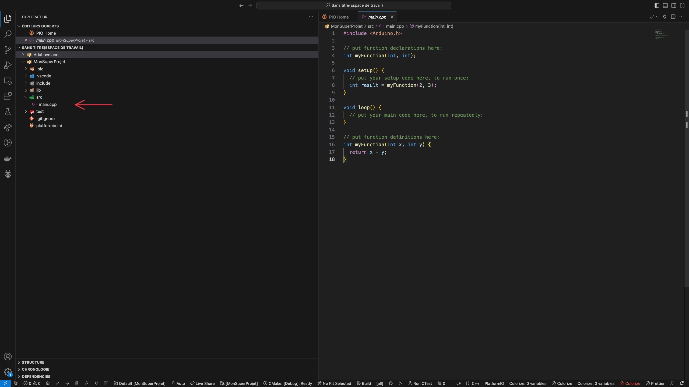

# Initiation à la programmation Arduino et ESP32


[TOC]
 
---


## Avant de commencer

Nous allons télécharger l'environnement de développement (IDE) Platform.IO sur Visual Studio Code. S'il n'est pas installé, vous pouvez le télécharger ici : 
- https://code.visualstudio.com/
- https://marketplace.visualstudio.com/items?itemName=platformio.platformio-ide

Ce n'est pas un cours d'électronique : nous passons donc sous silence un grand nombre de termes afin de pouvoir programmer rapidement un objet fonctionnel.

---

## Présentation de l'Arduino

L'Arduino est une carte construite autour d'un microcontrôleur qui peut être programmé pour analyser et produire des signaux électriques de manière à effectuer des tâches très diverses comme la domotique (le contrôle des appareils domestiques - éclairage, chauffage…), le pilotage d'un robot, de l'informatique embarquée, etc.

On peut étendre les capacités de l'Arduino en y branchant des composants, par exemple : des capteurs (de température, de son, de distance, etc.) ou encore des leds, des moteurs, etc. 

Chaque composant a besoin d'être alimenté : branché sur une source de tension (5V ou 3.3V) et une masse (GND) pour fonctionner. Pour renvoyer des informations (si c'est un capteur) ou en recevoir (par ex un servo-moteur), il faut aussi le brancher sur une (ou plusieurs) broche(s) de l'Arduino. Cela lui permet de communiquer avec ce dernier.

Ci-dessous une photo d'un Arduino Nano:


Le plus simple est d'utiliser un "shield" (bouclier) permettant d'avoir une alimentation (+5V, Ground) pour chaque broche afin de faciliter le câblage des composants. Branchez l'Arduino sur le bouclier en faisant en sorte que le port USB de l'Arduino soit du même côté que la grosse prise noire du bouclier.

Ci-dessous une photo d'un shield d'Arduino Nano:


## Présentation de l'ESP32

Pour cet atelier, nous allons utiliser une carte ESP32, qui fonctionne de la même manière que la carte arduino présentée ci-dessus.

Ci-dessous une photo d'un ESP32 et de son shield:


---

Si vous voulez apprendre à créer un projet à partir de zéro avec un ESP32 et des capteurs, allez au document [Initialisation d'un projet](./documentation/VotrePremierProjet.md).

Sinon ouvrez le projet `MonSuperProjet` dans Visual Studio Code.
Afin de le faire fonctionner, il faut indiquer au projet sur quelle prise USB est branchée la carte. 

Dans Visual Studio Code, cliquez sur la petite maison en bas à gauche, puis allez dans l'onglet devices pour la connaître.


Ensuite, dans le fichier `platformio.ini` à la racine de votre projet, remplacez les champs `upload_port` et `monitor_port` par le port où est branchée votre carte.


Maintenant que la carte est correctement branchée, vous pouvez commencer à programmer dans le fichier `main.cpp` dans le dossier `src`
 


# Jouons avec un feu tricolore !
Pour commencer à s'amuser avec l'ESP32, prenons une DEL (par la suite nous utiliserons le feu tricolore).

## On commence par apprendre à allumer la lumière...

La DEL (ou LED en anglais) est un composant simple s'allumant quand elle reçoit du courant. Nous allons commencer par brancher une DEL sur notre Arduino. Pour cela prenez 2 fils.

Les DEL ont des tensions précises de fonctionnement (entre 2.2V et 3V selon leur couleur) mais les broches de l'Arduino fournissent du +5V, il faut donc réduire l'alimentation des DEL en utilisant une résistance. Pour gagner du temps nous allons brancher directement nos DEL. Cela va réduire leur durée de vie mais dans le cadre de ce TP ça ne sera pas gênant.


* Branchez un fil entre la patte courte de la DEL et la broche G du port D5 de l'ESP32
* Branchez un fil entre la patte longue de la DEL et la broche S du port D5 de l'ESP32


Téléversez le programme suivant sur l'ESP32, cliquez sur l'icône en forme de tête de fourmi (menu PlatformIO à gauche de l'IDE), puis sur 'Upload and Monitor'. 

La DEL devrait clignoter !

Jouez avec la valeur inscrite dans les fonctions `delay` pour la faire clignoter plus ou moins vite.

```C
#include <Arduino.h>
#include <Wire.h>

#define LED1 5

void setup() {
  pinMode(LED1, OUTPUT);
}
void loop() {
  digitalWrite(LED1, HIGH);
  delay(500);
  digitalWrite(LED1, LOW);
  delay(500);
}
```

## Et maintenant le feu de circulation !

Prenez le feu tricolore présent dans votre kit. Détachez un groupe de 4 fils :

* Branchez un fil entre la broche **G** du feu et la broche **S** du port D5
* Branchez un fil entre la broche **Y** du feu et la broche **S** du port D4
* Branchez un fil entre la broche **R** du feu et la broche **S** du port D2
* Branchez un fil entre la broche **GND** du feu et la broche **G** du port D2, D4 ou D5


```C
#include <Arduino.h>
#include <Wire.h>

#define GREEN_PIN 5
#define YELLOW_PIN 4
#define RED_PIN 2

void setup() {
  pinMode(GREEN_PIN, OUTPUT);
  pinMode(YELLOW_PIN, OUTPUT);
  pinMode(RED_PIN, OUTPUT);
}

void loop() {
  digitalWrite(GREEN_PIN, HIGH);
  digitalWrite(YELLOW_PIN, LOW);
  digitalWrite(RED_PIN, LOW);
  delay(500); 
  digitalWrite(GREEN_PIN, LOW);
  digitalWrite(YELLOW_PIN, HIGH);
  digitalWrite(RED_PIN, LOW);
  delay(500);
  digitalWrite(GREEN_PIN, LOW);
  digitalWrite(YELLOW_PIN, LOW);
  digitalWrite(RED_PIN, HIGH);
  delay(500); 
}
```

---
# Un peu de théorie : Analyse d'un  programme Arduino


Tous les programmes Arduino doivent respecter cette structure :

```C
#include <Arduino.h> // ici, on déclare l'utilisation de la librairie Arduino

// Vous pouvez déclarer les variables globales de votre script ici
int entier = 0;
void setup() {
  // Cette fonction sera lancée une seule fois au démarrage de l'Arduino
  // C'est ici que vous initialiserez les entrées et sorties de l'Arduino
  // Typiquement vous pouvez initialiser la liaison série
  // entre l'Arduino et votre ordinateur :
  Serial.begin(115200);
}


void loop() {

    // Cette fonction sera appelée continuellement après le setup
    // Pour déboguer, la liaison série est pratique :

    Serial.println("Test");

    // La fonction "delay(X)" permet de mettre en pause le programme pendant X ms

    delay(200);

}
```
---

# Ouvrons la caverne d'AliBaba ...

Voici la liste des composants Arduino avec lesquels vous pourrez construire votre projet, avec le code exemple à utiliser pour les faire fonctionner.

## Mesurer une distance avec des ultrasons

On peut utiliser un capteur ultrason (HR-SR04) pour mesurer une distance. On envoie des ondes sonores (inaudibles) vers un obstacle et on mesure le temps qui s'écoule avant de les recapter. À partir de la mesure de ce temps écoulé on peut, grâce à la connaissance de la vitesse du son dans l'air, estimer la distance entre le capteur et l'objet devant lui.

En théorie, le capteur peut capter les obstacles sur un angle de 15° environ et permet de faire des mesures de distance entre 2 centimètres et 4 mètres avec une précision de 3 millimètres.


Détachez un groupe de 4 fils :
* Branchez un fil entre la broche **Trig** du capteur et la broche **S** du port D32
* Branchez un fil entre la broche **Echo** du capteur et la broche **S** du port D33
* Branchez un fil entre la broche **GND** du capteur et la broche **G** du port D32
* Branchez un fil entre la broche **VCC** du capteur et la broche **V** du port D32

Téléversez le code suivant :

```C
#include <Arduino.h>
#include <Wire.h>

#define trigPin 32
#define echoPin 33

void setup() {
  Serial.begin (115200);
  pinMode(trigPin, OUTPUT);
  pinMode(echoPin, INPUT);
}

void loop() {
  // Envoi une impulsion de 10 micro seconde sur la broche "trigger"
  digitalWrite(trigPin, LOW);
  delayMicroseconds(2);

  digitalWrite(trigPin, HIGH);
  delayMicroseconds(10);

  digitalWrite(trigPin, LOW);
  // Attend que la broche Echo passe au niveau HAUT
  // retourne la durée
  int duration = pulseIn(echoPin, HIGH);

  //Calculer la distance (en cm, basée sur la vitesse du son).
  int distance = duration / 58.2;
  Serial.print("distance=");
  Serial.println(distance);
  delay(500);
}
```

Travail complémentaire : faire un radar de recul. Selon la distance de l'obstacle, vous allumerez les DEL verte, jaune et enfin rouge du feu tricolore.

---

## Utiliser un bouton

On va utiliser ici un bouton un peu particulier :


Ce bouton intègre une DEL en plus d'un contact on/off. N'hésitez pas à démonter le bouton pour voir la DEL intégrée.

Pour commencer on ne va utiliser que le bouton.

Récupérer les 2 fils issus de la partie centrale du bouton (le bloc rouge et noir sur la photo précédente) :
* Branchez le fil de la partie - la broche **V** du port 34
* Branchez l'autre fil sur la broche **S** du port 34

Téléversez le programme suivant et regardez le terminal (en bas de votre écran) :
    
```C
#include <Arduino.h>
#include <Wire.h>

#define BUTTON_CLICK 34

void setup() {
  pinMode(BUTTON_CLICK, INPUT_PULLUP);  
  Serial.begin(115200);
}

void loop() {
  if (digitalRead(BUTTON_CLICK)) {
    Serial.println("bouton appuyé");

  } else {
    Serial.println("bouton relaché");
  }
  delay(400);
}
```

Quand vous appuyez sur le bouton, vous devez voir apparaître sur le terminal l'état du bouton (appuyé ou relaché).

Vous remarquerez ici que l'on déclare le "port" en "INPUT_PULLUP", cela veut dire que l'Arduino va connecter une de ses résistances internes entre la broche V du port (reliée au 5V) et sa broche d'entrée S.

On va maintenant utiliser la DEL intégrée. Débranchez la DEL précédemment branchée sur le port 5 (et le feu tricolore). Branchez ensuite le fil venant du côté noir du bouton sur la broche **G** du port 21 puis le fil venant du côté rouge du bouton sur la broche **S** du port 21 

Téléversez le programme suivant :

```C
#include <Arduino.h>
#include <Wire.h>

#define BUTTON_LED 21
#define BUTTON_CLICK 34

void setup() {
  pinMode(BUTTON_LED, OUTPUT);
  pinMode(BUTTON_CLICK, INPUT_PULLUP);
}

void loop() {
  // On allume la DEL quand on clique sur le bouton
  if (digitalRead(BUTTON_CLICK)) {
    digitalWrite(BUTTON_LED, HIGH);
  } else {
    digitalWrite(BUTTON_LED, LOW);
  }
}
```
Quand vous appuierez sur le bouton, la DEL devrait s'allumer.
    

---

## Utiliser un potentiomètre

Ce composant permet d'avoir une valeur analogique comprise entre 0 et 1023 selon la position du curseur.


Détachez un groupe de 3 fils. On va brancher les fils du côté "A" :
* Branchez un fil entre la broche OUT (à gauche) du potentiomètre et la broche ***S*** du port D34
* Branchez un fil entre la broche du milieu du potentiomètre et la broche ***G*** du port D34
* Branchez un fil entre la broche de droite du potentiomètre et la broche ***V*** du port D34

Téléversez le programme suivant et vérifiez que les valeurs s'affichent bien sur le terminal :
    
```C
#include <Arduino.h>
#include <Wire.h>

#define POTAR 34

void setup() {
  pinMode(POTAR, INPUT);
  Serial.begin(115200);
}

void loop() {
  int val = analogRead(POTAR);
  Serial.print("val=");
  Serial.println(val);
  int percent = map(val, 0, 1023, 0, 100);
  Serial.print("percent=");
  Serial.println(percent);
  delay(400);
}
```

Travail complémentaire : Faire varier le temps de clignotement d'une DEL avec le potentiomètre.

---

## Faire tourner un servomoteur

Un servomoteur est un petit moteur pouvant tourner précisément sur 180°.


Branchez directement la prise du servomoteur sur le port D23 de l'Arduino en faisant attention à ce que :
* le fil marron soit sur la broche ***G*** du port D23, 
* le fil rouge sur la broche ***V*** du port D23,
* le fil orange sur la broche ***S*** du port D23

Téléversez le programme suivant : 

```C
#include <Arduino.h>
#include <Wire.h>
#include <Servo.h>

#define SERVO 23

Servo myservo;
void setup() {
  Serial.begin(115200);
  myservo.attach(SERVO);
  myservo.write(0);
}

int deg = 0;
int inc = 1;
void loop() {
  myservo.write(deg);
  deg = deg + inc;
  if (deg > 180) {
    inc = -1;
    deg = 180;
  }
  if (deg < 0) {
    inc = 1;
    deg = 0;
  }
  delay(20);
}
```

La ligne `#include <Servo.h>` charge la bibliothèque permettant de piloter facilement un servomoteur. Cette bibliothèque est fournie dans votre fichier de configuration.

Ajoutez un des morceaux de plastique sur l'axe du servomoteur afin de bien visualiser les mouvements.

Travail complémentaire : Faire tourner le servomoteur à partir de la valeur d'un potentiomètre (utilisation de la fonction [map](https://www.arduino.cc/reference/en/language/functions/math/map/) pour convertir les valeurs d'entrées du potentiomètre - de 0 à 1023 - en une valeur en degrés - de 0 à 180) :

```C
#include <Arduino.h>
#include <Wire.h>
#include "Servo.h"
#define SERVO 23
#define POTAR 34

Servo myservo;

void setup() {
  Serial.begin(115200);
  pinMode(POTAR, INPUT);
  myservo.attach(SERVO);
  myservo.write(0);
}

void loop() {
  int val = analogRead(POTAR);
  Serial.print("val=");
  Serial.println(val);
  int deg = map(val, 0, 1023, 0, 180);
  myservo.write(deg);
  delay(10);
}
```

---

## Le Bus I²C

Le bus I²C permet de brancher plusieurs composants (esclaves) sur l'Arduino (maître). Vous trouverez plus d'informations sur  [la page Wikipédia sur le sujet](https://fr.wikipedia.org/wiki/I2C).

Il va nous permettre ici de brancher plusieurs composants supportant la norme I²C. Sur un ESP32 les ports I²C utilisent les ports D21 et D22, il ne faut donc pas brancher d'autres composants sur ces ports.

Pour brancher votre bus :
* le fil GND sur la broche GND à droite de la carte
* le fil VCC sur la broche VCC à droite de la carte
* le fil SDA sur la broche D21
* le fil SCL sur la broche D22


---

## Afficher des informations sur un écran LCD I²C

Les écrans LCD permettent d'afficher des informations facilement. La version présentée ici utilise une interface I²C.

Ces écrans nécessitent une bibliothèque particulière qui est déjà configurée dans votre projet.


Détachez un groupe de 4 fils :
* Branchez un fil entre la broche ***SCL*** de l'écran et la broche ***SCL*** de votre rampe I²C
* Branchez un fil entre la broche ***SDA*** de l'écran et la broche ***SDA*** de votre rampe I²C
* Branchez un fil entre la broche ***GND*** de l'écran et la broche ***GND*** de votre rampe I²C
* Branchez un fil entre la broche ***VCC*** de l'écran et la broche ***5V*** de votre rampe I²C

Téléversez le programme suivant :

```C
#include <Arduino.h>
#include <Wire.h>

#include <LiquidCrystal_I2C.h>
#define i2cDisplayPort 0x3F
LiquidCrystal_I2C lcd(i2cDisplayPort,16,2);
int increment = 0;

void setup() {
  lcd.init();
  lcd.setBacklight(HIGH); 
}
  
void loop() {

    lcd.clear();
    lcd.print("Ligne 1");
    lcd.setCursor(0, 1);
    lcd.print("Ligne 2 : ");
    lcd.print(increment);
    if (increment==10) {
      // On éteint le retroéclairage au bout de 10s
      lcd.setBacklight(LOW); 
    } else if (increment==12) {
      // On allume le retroéclairage au bout de 12s
      lcd.setBacklight(HIGH); 
    }
    increment++;
    delay(1000);
    
}
```

Vérifiez le contraste de l'écran : ce dernier doit s'allumer au démarrage. Si vous ne voyez rien, pas de panique c'est peut-être tout simplement parce que le contraste est mal réglé. Pour changer ce paramètre il suffit de tourner le petit potentiomètre derrière l'écran avec un tournevis cruciforme jusqu'à obtenir un bon contraste entre l'affichage des caractères et le fond de l'écran.


---


## Récupérer l'humidité et la température (I²C)

On va utiliser un composant I²C DHT11 afin de récupérer des informations sur la température et l'humidité.

Afin de gérer ce composant vous aurez besoin d'une nouvelle bibliothèque, elle aussi déjà installée dans votre projet.


Détachez un groupe de 4 fils :
* Branchez un fil entre la broche ***+*** du capteur et la broche ***V*** du pin D18
* Branchez un fil entre la broche ***Out*** du capteur et la broche ***S*** du pin D18
* Branchez un fil entre la broche ***-*** du capteur et la broche ***GND*** du pin D18


Téléversez le programme suivant :

```C
#include <Arduino.h>
#include <Wire.h>
#include <DHT.h>

#define DHT_PIN 18
#define DHT_TYPE DHT22 //DHT11 si capteur bleu

DHT dht(DHT_PIN, DHT_TYPE);

void setup() {
  Serial.begin(115200);
  dht.begin();
}

void loop() {
  Serial.print("temperature=");
  Serial.print(dht.readTemperature());
  Serial.println("°C");
  Serial.print("humidité=");
  Serial.print(dht.readHumidity());
  Serial.println("%");

  delay(1000);
}
```

Travail complémentaire : afficher sur l'écran LCD la température (sur la première ligne) et l'humidité (sur la deuxième ligne).

---

## Afficher l'heure sur un écran 4*7 segments

Un afficheur 4*7 segments permet d'afficher l'heure de façon claire (visible de loin).


Ici encore, une bibliothèque a été ajoutée à votre projet.

Détachez un groupe de 4 fils :
* Brancher un fil entre la broche **CLK** de l'afficheur et la broche **S** du port D26
* Brancher un fil entre la broche **DIO** de l'afficheur et la broche **S** du port D27
* Brancher un fil entre la broche **GND** de l'afficheur et la broche **G** du port D27
* Brancher un fil entre la broche **5V** de l'afficheur et la broche **V** du port D27

Téléversez le programme suivant :

```C
#include <Arduino.h>
#include <Wire.h>
#include <TM1637Display.h>

#define TM1637_CLK 26
#define TM1637_DIO 27

TM1637Display   FourDigitLedDisplay(TM1637_CLK, TM1637_DIO);

void setup() {
  Serial.begin(115200);
  // Luminosité de l'afficheur de 0 à 7
  FourDigitLedDisplay.setBrightness(5);
}

int seconds=0;
void loop() {
  int sep = 0;
  if (seconds % 2 == 0) {
    // On n'affiche le séparateur ':' qu'une seconde sur deux
    sep = 64;
  }
  FourDigitLedDisplay.showNumberDecEx(seconds, sep, true, 4, 0);
  seconds++;
  delay(1000);
}
```

En combinant ce code avec celui de l'horloge interne on peut afficher l'heure courante :

```C
#include <Wire.h>
#include <RTClib.h>
#include <TM1637Display.h>
#include <Wire.h>

#define TM1637_CLK 12
#define TM1637_DIO 13

TM1637Display display(TM1637_CLK, TM1637_DIO);
RTC_DS3231 rtc;

DateTime strToDateTime(String readString) {
  int year = readString.substring(0, 4).toInt();
  int month = readString.substring(4, 6).toInt();
  int day = readString.substring(6, 8).toInt();
  int hour = readString.substring(8, 10).toInt();
  int minute = readString.substring(10, 12).toInt();
  int second = readString.substring(12, 14).toInt();
  return DateTime(year, month, day, hour, minute, second);
}


String getKey(String str) {
  return str.substring(0, str.indexOf('='));
}

String getValue(String str) {
  if (str.indexOf('=')) {
    return str.substring(str.indexOf('=') + 1);
  } else {
    return "";
  }
}

String line;

void setup() {
  Serial.begin(9600);
  Wire.begin();
  if (! rtc.begin()) {
    Serial.println("Couldn't find RTC");
    while (1);
  }
  if (rtc.lostPower()) {
    Serial.println("RTC lost power, lets set the time!");
    // les lignes suivantes permettent de configurer l'heure et la date quand l'horloge n'est pas encore configurée
    rtc.adjust(DateTime(F(__DATE__), F(__TIME__)));
    // cela utilise l'heure et la date du PC
  }
  display.setBrightness(12);

}

void loop() {
  DateTime now = rtc.now();
  Serial.print(now.day(), DEC);
  Serial.print('/');
  Serial.print(now.month(), DEC);
  Serial.print('/');
  Serial.print(now.year(), DEC);
  Serial.print(' ');
  Serial.print(now.hour(), DEC);
  Serial.print(':');
  Serial.print(now.minute(), DEC);
  Serial.print(':');
  Serial.print(now.second(), DEC);
  Serial.println();
  int sep = 0;
  if (now.second() % 2 == 0) {
    // On n'affiche le séparateur ':' qu'une seconde sur deux
    sep = 64;
  }
  display.showNumberDecEx(now.hour() * 100 + now.minute(), sep, true, 4, 0);

  while (Serial.available()) {
    line = Serial.readStringUntil('\n');// On lit une ligne depuis le port série
    line.trim();
    if (line.startsWith("horloge=")) {
      Serial.println("reglage de l'horloge");
      String heure = getValue(line);
      rtc.adjust(strToDateTime(heure));
    }
  }
  // attente de 1s pour ne pas afficher trop d'informations dans le terminal
  delay(1000);
}
```


---

## Jouer de la musique (MP3)

Nous allons utiliser un module DFPLayer afin de lire des MP3 depuis une carte micro-SD.


Les chansons doivent être placées dans un répertoire nommé `mp3` sur la carte micro-SD et doivent être renommées afin qu'elles commencent par quatre chiffres (indiquant l'ordre de lecture). Les chansons suivantes ont été installées sur votre carte micro-SD :
    
Chanson 0001 : 
* Titre:  Broke Inside My Mind (feat Ellie Griffiths)
* Auteur: Anitek
* Source: [https://soundcloud.com/anitek](https://soundcloud.com/anitek)
* Licence: [CC BY-NC-ND](http://creativecommons.org/licenses/by-nc-nd/3.0/deed.fr)
* Téléchargement (6MB): [https://www.auboutdufil.com/index.php?id=472](https://www.auboutdufil.com/index.php?id=472)

Chanson 0002 :
* Titre:  Summer Spliffs
* Auteur: Broke For Free
* Source: [http://brokeforfree.bandcamp.com/](http://brokeforfree.bandcamp.com/)
* Licence: [CC BY](https://creativecommons.org/licenses/by/3.0/deed.fr)
* Téléchargement (9MB): [https://www.auboutdufil.com/index.php?id=495](https://www.auboutdufil.com/index.php?id=495)

Chanson 0003 :
* Titre:  Barefoot Girl Pebble Road
* Auteur: Twizzle
* Source: [http://www.myspace.com/twizzlesizzles](http://www.myspace.com/twizzlesizzles)
* Licence: http://creativecommons.org/licenses/by-nc/2.0/deed.fr
* Téléchargement (4MB): [https://www.auboutdufil.com/index.php?id=432](https://www.auboutdufil.com/index.php?id=432)

Chanson 0004 : 
* Titre:  Final
* Auteur: K Soviet
* Source: [http://ksoviet.blogspot.com](http://ksoviet.blogspot.com)
* Licence: [CC BY-NC-SA](https://creativecommons.org/licenses/by-nc-sa/4.0/deed.fr)
* Téléchargement (5MB): [https://www.auboutdufil.com/index.php?id=484](https://www.auboutdufil.com/index.php?id=484)

Chanson 0005 : 
* Titre:  Plastic Submarine
* Auteur: The Grammar Club
* Source: [https://www.facebook.com/TheGrammarClub](https://www.facebook.com/TheGrammarClub)
* Licence: [CC BY-NC-SA](https://creativecommons.org/licenses/by-nc-sa/3.0/deed.fr)
* Téléchargement (10MB): [https://www.auboutdufil.com/index.php?id=478](https://www.auboutdufil.com/index.php?id=478)


Insérez la carte micro-SD dans le module.
    
Une nouvelle fois, une bibliothèque a été rajoutée dans votre fichier de configuration.


**Attention** : Aidez-vous du schéma ci-dessus pour faire les branchements. Faites toutefois attention, les broches de connexions sont en dessous du module si vous le mettez dans même position que sur le schéma.

Récupérez le cable avec la résistance intégrée et branchez le entre la broche **S** du port **11** et la broche **RX** du module.

Détachez un groupe de 3 fils :
* Branchez un fil entre la broche **S** du port RX2 et la broche **TX** du module
* Branchez un fil entre la broche **G** du port RX2 et la broche **GND**  du module
* Branchez un fil entre la broche **V** du port RX2 et la broche **VCC**  du module
* Branchez un fil entre ma broche **S** du port TX2 et la proche **RX**  du module

Pour les enceintes, détachez un groupe de 2 fils  :
* Branchez un fil entre une des broche côté enceinte et la broche **SPK_1** du module
* Branchez un fil entre l'autre broche côté enceinte et la broche **SPK_2** du module

Téléversez le programme suivant :

```C
#include <Arduino.h>
#include <SoftwareSerial.h>
#include <DFRobotDFPlayerMini.h>
#include <Wire.h>

#define DFPLAYER_RX 16 // RX2
#define DFPLAYER_TX 17 // TX2

SoftwareSerial dfplayer(DFPLAYER_RX, DFPLAYER_TX); // RX, TX
DFRobotDFPlayerMini mp3;

String line;

String getKey(String str)
{
  return str.substring(0, str.indexOf('='));
}

String getValue(String str)
{
  if (str.indexOf('='))
  {
    return str.substring(str.indexOf('=') + 1);
  }
  else
  {
    return "";
  }
}

void menu_opcoes()
{
  Serial.println();
  Serial.println(F("================================================================================================================"));
  Serial.println(F("Commands:"));
  Serial.println(F(" [1-3] Sélectionner le fichier mp3"));
  Serial.println(F(" [s] stop"));
  Serial.println(F(" [p] play/pause"));
  Serial.println(F(" [+ or -] baisser/augmenter le volume"));
  Serial.println(F(" [< or >] piste précédente/suivante"));
  Serial.println();
  Serial.println(F("================================================================================================================"));
}

char command;
int pausa = 0;

void setup()
{
  Serial.begin(115200);
  dfplayer.begin(9600);

  Serial.println(mp3.begin(dfplayer));

  if (!mp3.begin(dfplayer))
  { // Use softwareSerial to communicate with mp3.
    Serial.println(F("Unable to begin:"));
    Serial.println(F("1.Please recheck the connection!"));
    Serial.println(F("2.Please insert the SD card!"));
    while (true)
    {
      delay(0); // Code to compatible with ESP8266 watch dog.
    }
  }
  Serial.println(F("DFPlayer Mini online."));

  mp3.volume(1);
}

void loop()
{

  // Waits for data entry via serial
  while (Serial.available() > 0)
  {
    command = Serial.read();

    if ((command >= '1') && (command <= '9'))
    {
      Serial.print("Music reproduction");
      Serial.println(command);
      command = command - 48;
      mp3.play(command);
      menu_opcoes();
    }

    // Reproduction
    // Stop

    if (command == 's')
    {
      mp3.stop();
      Serial.println("Music Stopped!");
      menu_opcoes();
    }

    // Play/pause
    if (command == 'p')
    {
      pausa = !pausa;
      if (pausa == 0)
      {
        Serial.println("Continue...");
        mp3.start();
      }

      if (pausa == 1)
      {
        Serial.println("Music Paused!");
        mp3.pause();
      }

      menu_opcoes();
    }

    // Increases volume
    if (command == '+')
    {
      mp3.volumeUp();
      Serial.print("Current volume:");
      Serial.println(mp3.readVolume());
      menu_opcoes();
    }

    if (command == '<')
    {
      mp3.previous();
      Serial.println("Previous:");
      Serial.print("Current track:");
      Serial.println(mp3.readCurrentFileNumber() - 1);
      menu_opcoes();
    }

    if (command == '>')
    {
      mp3.next();
      Serial.println("next:");
      Serial.print("Current track:");
      Serial.println(mp3.readCurrentFileNumber() + 1);
      menu_opcoes();
    }

    // Decreases volume
    if (command == '-')
    {
      mp3.volumeDown();
      Serial.print("Current Volume:");
      Serial.println(mp3.readVolume());
      menu_opcoes();
    }
  }
}
```

Vous pouvez contrôler la lecture avec les commandes suivantes depuis le terminal :
* [1-3] Sélectionner le fichier mp3 a lancer
* [s] stop
* [p] play/pause
* [+ or -] baisser/augmenter le volume
* [< or >] piste précédente/suivante


---

## Utiliser une matrice à DEL

Vous pouvez utiliser la matrice à DEL (8*8) pour afficher des messages ou des icônes.


Une nouvelle fois, une bibliothèque a été ajoutée à votre projet.

Détachez un groupe de 3 fils  :
* Branchez un fil entre la broche **DIN** de la matrice et la broche **S** du port D13
* Branchez un fil entre la broche **5V** de la matrice et la broche **V** du port D13
* Branchez un fil entre la broche **GND** de la matrice et la broche **G** du port D13

Téléversez le code suivant :

```C
#include <Arduino.h>
#include <Wire.h>
#include <Adafruit_NeoPixel.h>

#define PIN_MATRICE     13
#define NB_LIGNES       8
#define NB_COLONNES     8

#define HEADER_PIXEL(data,pixel) {\
    pixel[0] = ((((data)[0] - 33) << 2) | ((data[1] - 33) >> 4)); \
    pixel[1] = ((((data[1] - 33) & 0xF) << 4) | ((data[2] - 33) >> 2)); \
    pixel[2] = ((((data[2] - 33) & 0x3) << 6) | ((data[3] - 33))); \
    data += 4; \
  }


const char pluie[] PROGMEM = "!!!!!!!!!!!!QM0(QM0(QM0(!!!!!!!!!!!!!!!!QM0(QM0(QM0(QM0(QM0(!!!!!!!!!!!!QM0(QM0(QM0(QM0(QM0(!!!!QM0(QM0(QM0(QM0(QM0(QM0(QM0(QM0(!!!!!!!!!!!!!!!!!!!!!!!!!!!!!!!!+;X`!!!!!!!!+;X`!!!!!!!!+;X`!!!!!!!!!!!!!!!!!!!!!!!!!!!!!!!!!!!!!!!!+;X`!!!!!!!!+;X`!!!!!!!!+;X`";
const char soleil[] PROGMEM = "`[-!`[-!!!!!`[-!`[-!!!!!`[-!`[-!`[-!!!!!``]H``]H``]H``]H!!!!`[-!!!!!``]H``]H``]H``]H``]H``]H!!!!`[-!``]H``]H``]H``]H``]H``]H`[-!`[-!``]H``]H``]H``]H``]H``]H`[-!!!!!``]H``]H``]H``]H``]H``]H!!!!`[-!!!!!``]H``]H``]H``]H!!!!`[-!`[-!`[-!!!!!`[-!`[-!!!!!`[-!`[-!";
const char nuit[] PROGMEM = "!!!!!!!!QM0(``(I``(I``(I!!!!!!!!!!!!QM0(``(IQM0(!!!!!!!!QM0(!!!!QM0(``(I``(I!!!!!!!!!!!!!!!!!!!!``(I``(I``(I!!!!!!!!!!!!!!!!!!!!``(I``(I``(I!!!!!!!!!!!!!!!!!!!!QM0(``(I``(IQM0(!!!!!!!!!!!!QM0(!!!!QM0(``(I``(I``(I``(IQM0(!!!!!!!!!!!!QM0(QM0(QM0(QM0(!!!!!!!!";
const char coeur[] PROGMEM = "!!!!`Q\".`Q\".!!!!!!!!`Q\".`Q\".!!!!``(I``(I`Q\".`Q\".`Q\".`Q\".`Q\".`Q\".``(I`Q\".`Q\".`Q\".`Q\".`Q\".`Q\".`Q\".`X?I`Q\".`Q\".`Q\".`Q\".`Q\".`Q\".`Q\".!!!!`X?I`Q\".`Q\".`Q\".`Q\".`Q\".!!!!!!!!!!!!`Q\".`Q\".`Q\".`Q\".!!!!!!!!!!!!!!!!!!!!`Q\".`Q\".!!!!!!!!!!!!!!!!!!!!!!!!!!!!!!!!!!!!!!!!!!!!";
const char smiley[] PROGMEM = "!!!!!!!!``]H``]H``]H``]H!!!!!!!!!!!!``]H``]H``]H``]H``]H``]H!!!!``]H!!!!``]H``]H``]H``]H!!!!``]H``]H!!!!``]H``]H``]H``]H!!!!``]H``]H``]H``]H``]H``]H``]H``]H``]H``]H!!!!``]H``]H``]H``]H!!!!``]H!!!!``]H!!!!!!!!!!!!!!!!``]H!!!!!!!!!!!!``]H``]H``]H``]H!!!!!!!!";
const char nuage[] PROGMEM = "!!!!!!!!`[-!`[-!`[-!!!!!!!!!!!!!!!!!`[-!``]H``]H``]H`[-!!!!!!!!!`[-!``]H``]H``]HAX;=AX;=AX;=!!!!`[-!``]H``]HAX;=QM0(QM0(QM0(AX;=`[-!``]H``]HAX;=QM0(QM0(QM0(QM0(!!!!`[-!AX;=QM0(QM0(QM0(QM0(QM0(AX;=AX;=QM0(QM0(QM0(QM0(QM0(QM0(`[-!`[-!!!!!`[-!`[-!!!!!`[-!`[-!";

Adafruit_NeoPixel pixels(64, PIN_MATRICE, NEO_GRB + NEO_KHZ800);

String getKey(String str) {
  return str.substring(0, str.indexOf('='));
}

String getValue(String str) {
  if (str.indexOf('=')) {
    return str.substring(str.indexOf('=') + 1);
  } else {
    return "";
  }
}

void displayImage(String imageName) {
  int p[3];
  char buffer[260];
  if (imageName == "pluie") {
    strcpy_P(buffer, pluie);
  } else if (imageName == "soleil") {
    strcpy_P(buffer, soleil);
  } else if (imageName == "nuit") {
    strcpy_P(buffer, nuit);
  } else if (imageName == "coeur") {
    strcpy_P(buffer, coeur);
  } else if (imageName == "smiley") {
    strcpy_P(buffer, smiley);
  } else if (imageName == "nuage") {
    strcpy_P(buffer, nuage);
  }
  char* buf = buffer;
  for (int i = 0; i < 8 * 8; i++)  {
    HEADER_PIXEL(buf, p);
    pixels.setPixelColor(i, pixels.Color(p[0], p[1], p[2]));
  }

  pixels.show();
}

void setup() {
  Serial.begin(115200);

  Wire.begin();
  pixels.begin();
  // Ne pas mettre trop fort (>50) les DEL au risque de "cramer" l'Arduino
  pixels.setBrightness(30);
}


void loop() {
  displayImage("coeur");
}
```

---

## Utiliser un capteur de mouvements

On peut détecter des mouvements grace au capteur suivant. 


Commencez par brancher le capteur à l'ESP32, prenez 3 fils : 

* Branchez la broche **OUT** du capteur sur la broche **S** du port 15
* Branchez la broche **V** du capteur sur la broche **V** du port 15
* Branchez la broche **G** du capteur sur la broche **G** du port 15

Téléversez le code suivant :

```C
#include <Arduino.h>
#include <Wire.h>

#define PIN_DETECT_MOUV 15

void setup() {
    Serial.begin(115200);

}

void loop() {
  bool status = (digitalRead(PIN_DETECT_MOUV) == HIGH);
    if (status) {
        Serial.println("mouvement detecté");
    }
}
```

## Utiliser un capteur de luminosité (LDR)

On peut mesurer la luminosité ambiante grâce à une [photorésistance](https://fr.wikipedia.org/wiki/Photor%C3%A9sistance) (*Light Dependent Resistor*, *LDR* ou *photoresistor* en anglais). 


On ne va pas détailler ici le pré-cablage que l'on a fait avec la photorésitance et la résistance, suivez simplement ces étapes :
* Branchez le fil réunissant une patte de la photorésistance et une patte de la résistance sur la broche **S** du port 34
* Branchez le fil venant de la patte restante de la photorésistance sur la broche **G** du port 34
* Branchez le fil venant de la patte restante de la résistance sur la broche **V** du port 34

Téléversez le code suivant :

```C
#include <Arduino.h>
#include <Wire.h>

#define LDR 34

void setup() {
    Serial.begin(115200);

}

void loop() {
  int lum = analogRead(LDR);
  Serial.print("luminosite=");
  Serial.println(lum);
  delay(500);
}
```
    
Vous devriez voir dans le terminal la valeur de la luminosité, recouvrez ou éclairez la photorésistance pour voir cette valeur changer.

En combinant ce code avec celui de l'afficheur 4*7 segments, on peut faire un programme qui change l'éclairage de l'afficheur selon la luminosité :

```C
#include <TM1637Display.h>
#define TM1637_CLK 12
#define TM1637_DIO 13
#define LDR A7

TM1637Display display(TM1637_CLK, TM1637_DIO);

void setup() {
  Serial.begin(9600);
}

void loop() {
  int lum = analogRead(LDR);
  Serial.print("luminosite=");
  Serial.println(lum);
  int brightness = map(lum, 0, 1023, 0, 7);
  display.setBrightness(brightness);
  display.showNumberDec(lum);
  delay(500);
}
```

---

## DEL RVB

Une DEL RVB (Rouge, Vert, Bleu ou RGB en anglais pour Red, Green, Blue) permet de choisir la couleur de la lumière. Chaque composante de la lumière (rouge, verte et bleue) peut prendre une valeur de 0 à 255. 


Il faut brancher les broches R,G et B de la DEL sur des ports PWM de l'Arduino (typiquement les ports D2, D4, D5). Détachez un groupe de 4 fils :
* Branchez un fil entre la broche ***G*** de la DEL sur la broche ***S*** du port D4
* Branchez un fil entre la broche ***B*** de la DEL sur la broche ***S*** du port D5
* Branchez un fil entre la broche ***R*** de la DEL sur la broche ***S*** du port D2
* Branchez un fil entre la broche ***-*** de la DEL sur la broche ***G*** du port D2, D4 ou D5

```C
#include <Arduino.h>
#include <Wire.h>

#define RED 2
#define BLUE 5
#define GREEN 4

void setup() {
  pinMode(RED, OUTPUT);
  pinMode(BLUE, OUTPUT);
  pinMode(GREEN, OUTPUT);
  randomSeed(analogRead(0));
}
void loop() {
  analogWrite(RED,
              random(255));
  analogWrite(BLUE,
              random(255));
  analogWrite(GREEN,
              random(255));
  delay(500); 
}
```

---

## Moteur pas-à-pas 

Vous n'aurez normalement pas besoin de ce composant pour votre projet, mais voici tout de même sa documentation si vous voulez l'utiliser plus tard.

Un moteur pas-à-pas permet de gérer des rotations précises ([documentation](http://www.airspayce.com/mikem/arduino/AccelStepper/))


Une nouvelle fois, une bibliothèque a été ajoutée à votre projet.

Branchez le câble du moteur pas-à-pas sur la carte de contrôle. Détachez un groupe de 4 fils pour les broches ***IN*** et un groupe de 2 fils pour les broches ***-*** et ***+***: 
* Branchez un fil entre la broche ***IN1*** du contrôleur et la broche ***S*** du port ***D19*** de l'Arduino
* Branchez un fil entre la broche ***IN2*** du contrôleur et la broche ***S*** du port ***D26*** de l'Arduino
* Branchez un fil entre la broche ***IN3*** du contrôleur et la broche ***S*** du port ***D25*** de l'Arduino
* Branchez un fil entre la broche ***IN4*** du contrôleur et la broche ***S*** du port ***D12*** de l'Arduino
* Branchez un fil entre la broche ***-*** du contrôleur et la broche ***GND*** (à gauche du shield) de l'Arduino
* Branchez un fil entre la broche ***+*** du contrôleur et la broche ***5V*** (à gauche du shield) de l'Arduino


### Mode bloquant

```C
#include <Arduino.h>
#include <AccelStepper.h>
#include <Wire.h>

#define motorPin1  19
#define motorPin2  26
#define motorPin3  25
#define motorPin4  12
AccelStepper stepper(
    AccelStepper::HALF4WIRE,
    motorPin1, motorPin3,
    motorPin2, motorPin4);

void setup() {
  stepper.setMaxSpeed(1000);
  stepper.setAcceleration(100.0);
  stepper.enableOutputs();
}
void loop() {
    stepper.runToNewPosition(0);
    stepper.runToNewPosition(1000);
}
```


### Mode non-bloquant

Dans le code précédent à chaque appel à la fonction ***runToNewPosition*** le programme attend la fin de la rotation du moteur pour exécuter la ligne de code suivante. Voici ici un exemple de code permettant de faire tourner le moteur sans bloquer le programme :

```C
#include <Arduino.h>
#include <AccelStepper.h>
#include <Wire.h>

#define motorPin1  19
#define motorPin2  26
#define motorPin3  25
#define motorPin4  12

AccelStepper stepper(
    AccelStepper::HALF4WIRE,
    motorPin1, motorPin3,
    motorPin2, motorPin4);

  boolean isCommandTerminated() {
  stepper.setSpeed(1000);    
  int d = stepper.distanceToGo();
  stepper.runSpeedToPosition();
  if (d == 0) {
    return true;
  } else {
    return false;
  }
}

void setup() {
  stepper.setMaxSpeed(1000);
  stepper.move(1);
  Serial.begin(115200);
}

void loop() {
  if (isCommandTerminated()) {
    Serial.println("fin");
    delay(500);
    stepper.move(300);
  }
}
```

---


# Construire votre projet 

Maintenant que vous avez appris à utiliser chacun des capteurs, vous allez pouvoir continuer à utiliser le projet `MonSuperProjet`. Nous vous recommandons de créer le code de chacque capteur dans un fichier propre à celui-ci et d'appeler les fonctions dans `main.cpp`, ceci rendra votre code plus clair. Vous trouverez un exemple d'architecture de code dans le projet `CodeDeReference`.

Maintenant, c'est à vous de choisir ce que vous voulez faire comme projet avec le matériel précédemment présenté. Votre mission, si vous l'acceptez, est de **créer un objet connecté fun pour les ados**.

---

## La suite

Vous allez maintenant utiliser AppInventor afin de contrôler votre projet depuis une application mobile. Pour faire communiquer votre application mobile avec l'ESP32, vous vous référerez à la fiche [Créer un serveur web](./documentation/CreerUnServeurWeb.md)


