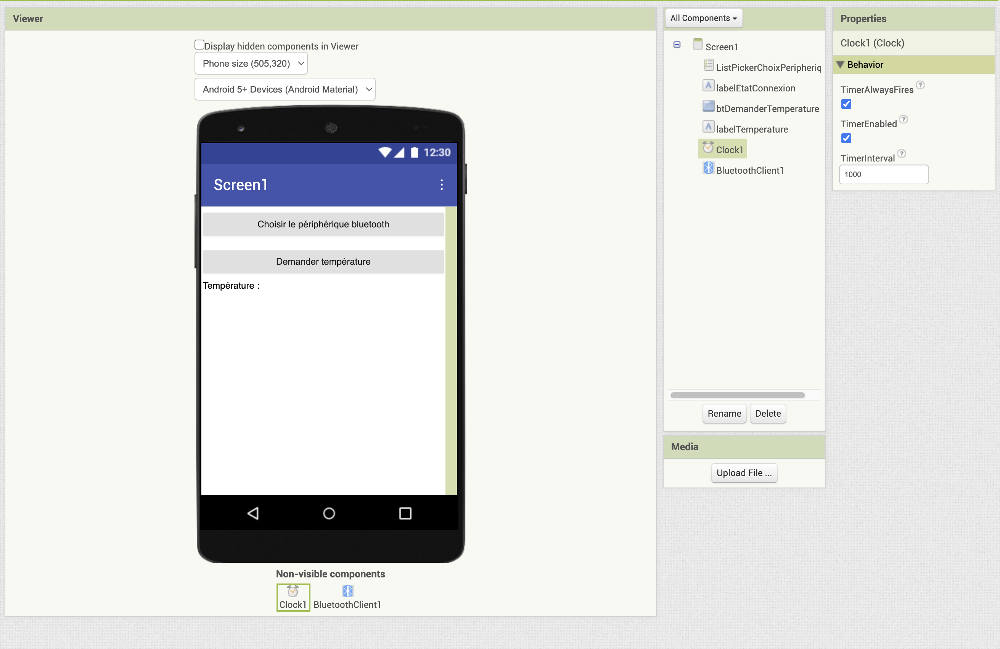
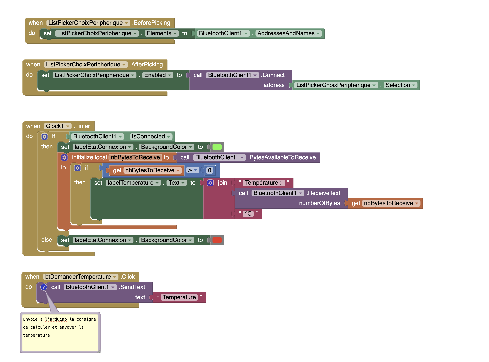

# Créer une interface Bluetooh avec l'ESP32

L'ESP32 comporte une interface Bluetooth

Malheureusement les contraintes de capacité mémoire de l'ESP32 ne permettent pas d'utiliser à la fois les librairies Wifi et Bluetooth...

Pour initialiser le bluetooth,  copier ce code dans main.cpp :

```cpp
#include <Arduino.h>
#include <Wire.h>
#include <SPI.h>
#include <WiFi.h>
#include <BluetoothSerial.h>

BluetoothSerial SerialBT;

void setup()
{
  // Code execute une seule fois au demarrage
  Serial.begin(115200);
  SerialBT.begin("ESP32 Bluetooth"); // Nom du peripherique Bluetooth
  Serial.println("Le Bluetooth est pret a etre utilise !");
}

void loop()
{
  if (Serial.available()) { // Code pour afficher sur la console et sur la sortie bluetooth ce qu'on saisit au clavier
    char c = Serial.read(); 
    SerialBT.write(c);
    Serial.write(c);
  }

  if (SerialBT.available()) { // Code pour écrire sur la console ce qu'on a lu sur l'entrée bluetooth
    char data = SerialBT.read();
    Serial.print("Data received : ");
    Serial.println(data);
  }

  // Envoyer une donnée via Bluetooth
  SerialBT.print("sending some data");
  delay(1000);
}
```

Pour tester ce code, installez sur un telephone une application telle que "Serial Bluetooth Terminal"


# Créer une application bluetooth avec AppInventor

Nous allons ici créer une mini application comportant les fonctionnalités suivantes :
- sur l'Arduino : mise en place d'un capteur de temperature et envoi de la temperature sur le bluetooth 
- sur l'application (App Inventor) : connexion au Bluetooth, envoi de la consigne de calcul de temperature et lecture et affichage de la temperature

Voici le code sur l'Arduino :

```cpp
#include <BluetoothSerial.h>
#include <Arduino.h>
#include <Wire.h>
#include <SPI.h>
#include <Adafruit_I2CDevice.h>
#include <DHT.h>

BluetoothSerial SerialBT;
#define DHT_PIN 18
#define DHT_TYPE DHT11

DHT dht(DHT_PIN, DHT_TYPE);

void setup() {
  Serial.begin(115200); //vitesse de la carte
  SerialBT.begin("ESP32"); //initialisation du bluetooth
  dht.begin(); // initialisation du capteur de température
}
void loop() {
  if (Serial.available()) { 
    char c = Serial.read();
    SerialBT.write(c);
    Serial.write(c);
  }
  if (SerialBT.available()) {
    receivedString = SerialBT.readString();
    Serial.print(receivedString); // Affichage sur la sortie serie du contenu de l'entrée bluetooth
    if (receivedString.indexOf("Temperature") != -1) { // si le message reçu sur bluetooth contient "Temperature" on mesure la temperature puis on l'envoie sur le bluetooth
      if(isnan(dht.readTemperature()) == 0) { //Si la température est un nombre
        float temperature = dht.readTemperature(); 
        String strTemp = String(temperature); 
        Serial.println(strTemp);
        SerialBT.print(strTemp);
      }
    }
  }
}
```

Et le code de l'application App Inventor





