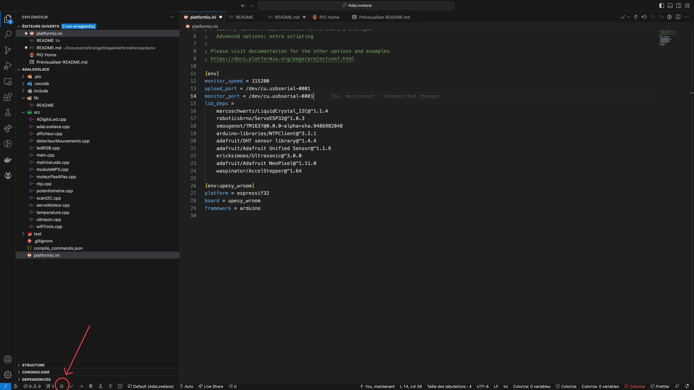
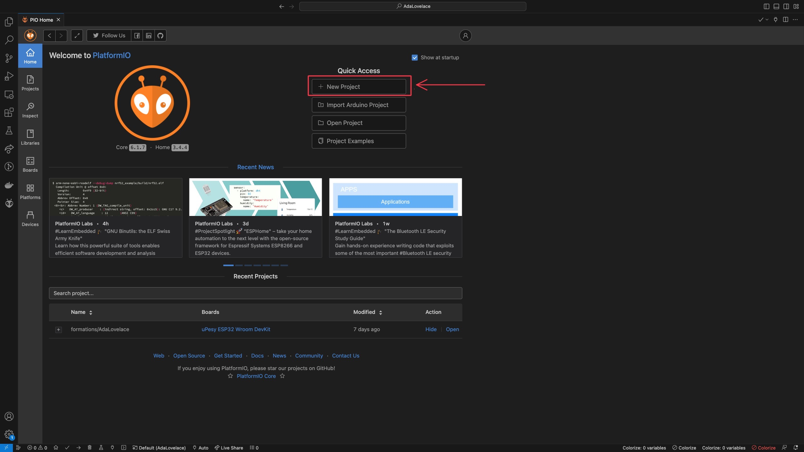
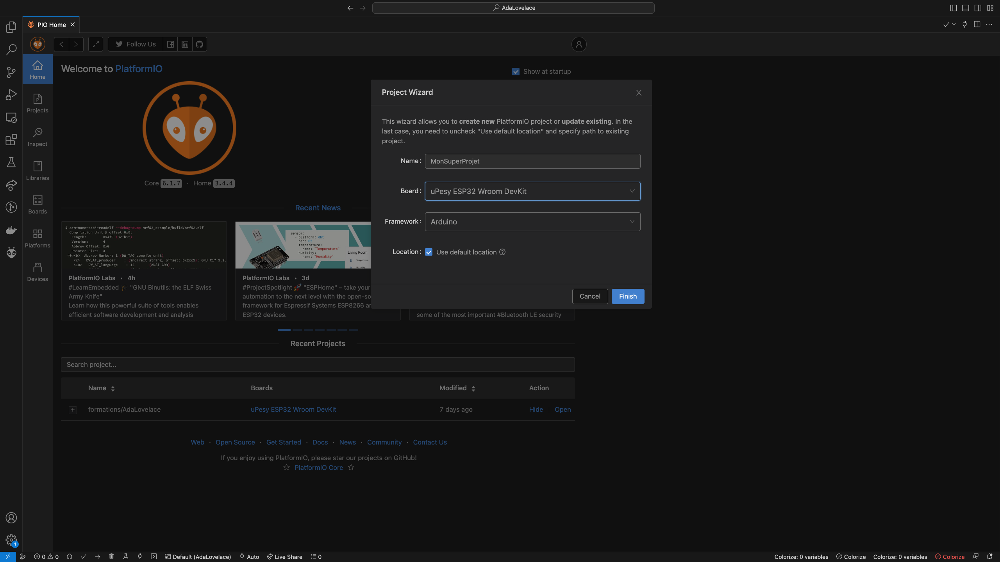
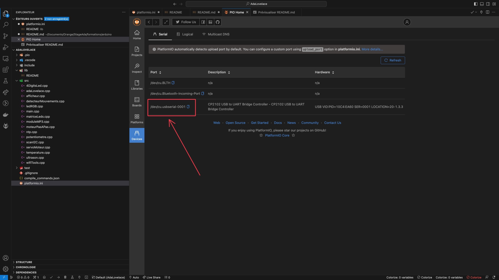

# Initialisation d'un projet Arduino/ESP32 avec PlatformIO

**_Nota Bene:_** Nous allons créer un projet pour une carte ESP32, mais le principe reste le même pour une carte Arduino. 

## Branchement de l'ESP32

Pour programmer l'ESP32, il suffit de le brancher en utilisant le port USB-C sur la carte (non pas sur le shield) sur un des ports USB de votre ordinateur.  

Afin d'apprendre à utiliser chaque capteur, nous allons créer un nouveau projet.

Il faut tout d'abord ouvrir VSCode puis aller sur le menu de PlatformIO, en cliquant sur l'icône de la petite maison en bas à gauche.



Ensuite il faut cliquer sur "New Project".




Une popup s'affiche pour vous aider à entrer des informations sur la carte que nous allons utiliser, ici une _**ESP32-Wroom**_




Une fois le projet créé vous allez avoir besoin de rentrer certaines informations dans le fichier `platformio.ini` à la racine de votre projet. Commencez par récupérer le nom du port où vous avez branché votre carte. Dans Visual Studio Code, cliquez sur la petite maison en bas à gauche, puis allez dans l'onglet devices pour le connaître.




Ensuite, dans le fichier `platformio.ini` à la racine de votre projet, remplacez les champs `upload_port` et `monitor_port` par le port où est branchée votre carte.


Maintenant que la carte est correctement branchée, vous pouvez commencer à programmer dans le fichier `main.cpp` dans le dossier `src`


Tapez le programme suivant (pas trop fort, sinon il va se faire mal) :
    
```C
void setup() {
  Serial.begin(115200);
  Serial.println("setup");
}
int i=0;
void loop() {
  Serial.print("loop ");
  Serial.println(i);
  i++;
  delay(1000);
}
```

Téléversez le programme sur l'ESP32 (menu PlatformIO à gauche de l'IDE, puis Upload and Monitor). Vous devriez voir apparaître toutes les secondes une nouvelle ligne dans le terminal.